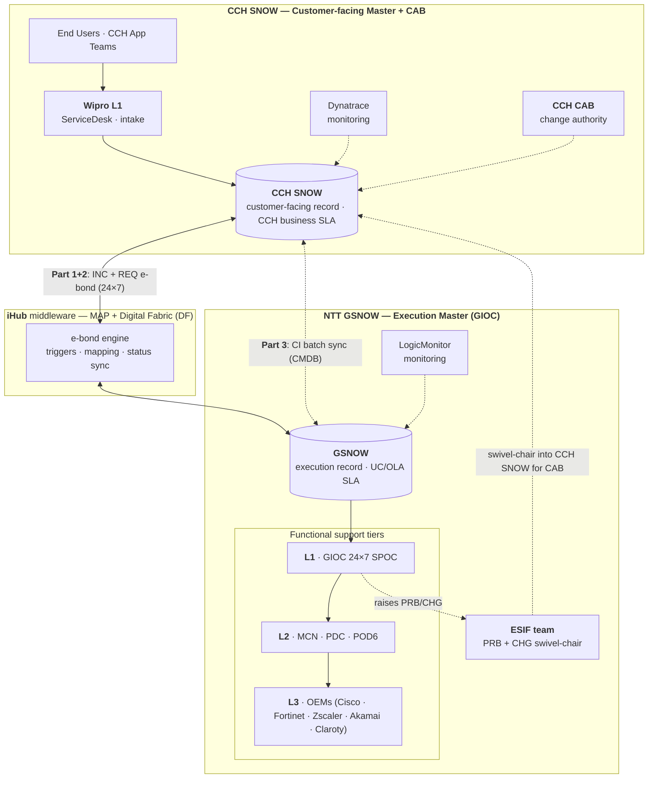
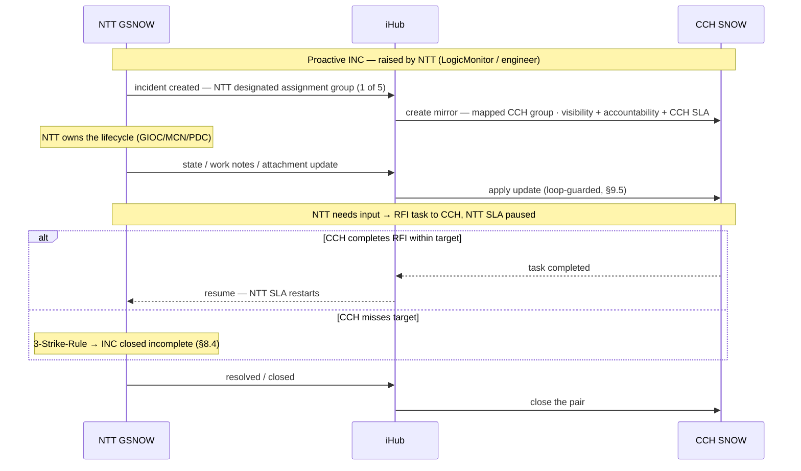
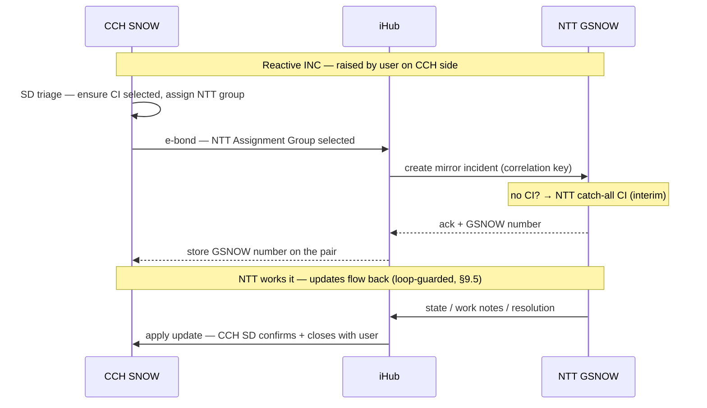
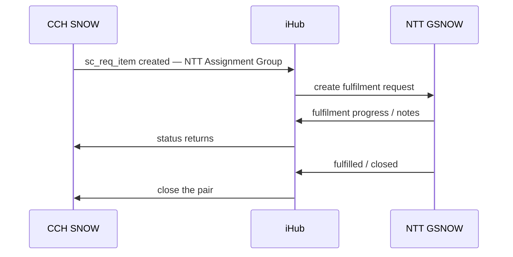

# NTT ↔ CCH ServiceNow Integration — HLD (iHub E-Bond: INC + REQ · Manual CMDB · PRB + CHG Swivel-Chair)

---

## 1. Document Control

**Date**: 2026-06-09 
**Status**: Draft — for team review 
**Author**: Victor Andreev

## 2. Sign-offs

| Name | Role |
|---|---|
| | Service Owner — ServiceNow (CCH) |
| | Service Owner — GSNOW (NTT) |
| | Change Manager / CAB Chair (CCH) |
| | Configuration Manager / CSDM Architect (CCH) |
| | Problem Manager (CCH) |
| | Information Security (CCH) |
| | Service Delivery Manager — NTT |
| | Service Desk Lead (Wipro, L1) |

## 3. Introduction

This blueprint defines the **ITSM integration** between **CCH's ServiceNow (CCH SNOW)** and **NTT DATA's ServiceNow (GSNOW)** for the NTT managed-service contract covering CCH network, connectivity, and managed-cloud infrastructure (Cisco, Fortinet, Zscaler, Akamai, Claroty xDome / NAC4OT, and the Azure footprint).

NTT operates **through** CCH's existing tooling, not instead of it — a supplemental managed-service overlay. The integration is delivered over NTT's **iHub** middleware (on the **Managed Automation Platform (MAP)** and **Digital Fabric (DF)**), enabling bidirectional ticket e-bonding so incidents and requests created or updated in one system reflect in the other in near real time.

**Design principle.** OOTB-first, **per-process integration** over iHub. Automate where volume and 24×7 operation demand it; keep manual where governance and low volume make it acceptable. **CCH ServiceNow ("CCH SNOW") remains the customer-facing system of record**; **NTT ServiceNow ("GSNOW") is the supplier-internal execution layer**. **Incident** and **Request** synchronise **bidirectionally via iHub**; **Configuration** is synchronised **manually** per an agreed process (each party owns its own CMDB); **Problem** and **Change** are handled **swivel-chair** by the **ESIF team** into CCH SNOW. CCH retains **CAB authority**; under swivel-chair, ESIF/NTT raises the change in CCH SNOW for CAB approval before executing.

**Governance regimes.** E-bonded incident handling and CCH's internal incident process run under different governance regimes. Internal incidents are governed by CCH's **business SLA** (CCH to its own end users); e-bonded incidents are governed by the **underpinning contract** (NTT's UC/OLA). On **proactive** incidents (NTT-raised) NTT is both source and resolver, and the CCH record is a **mirror** held for visibility and accountability — CCH **Accountable**, NTT **Responsible**. On **reactive** incidents (CCH-raised) L1 ServiceDesk triages and functionally escalates to the designated NTT group(s). In neither case does CCH apply its internal **BSO/TSO hierarchic escalation** to the e-bonded record; escalation is **functional**, on NTT's tiers. The exception is a **Major Incident (P1)**, where CCH's own major-incident management re-engages and the e-bond bridges to NTT's GIOC **(TBC — confirm the P1 bridge model with CCH MIM + NTT GIOC; Decision #8)**.

The design is **selective by process**, matching the mechanism to each practice:

| Practice | Mechanism | Owner / detail |
|---|---|---|
| **Incident** | **iHub e-bond** (automated, bidirectional, 24×7) | High volume, time-critical |
| **Request** | **iHub e-bond** (automated, bidirectional) | Standard requests 24×7; rest business-hours |
| **Configuration** | **Manual CMDB sync** (agreed process) | Each party owns its CMDB; CI + Managed Service mandatory on every ticket |
| **Problem** | **Swivel-chair** (manual) | **ESIF team** manages PRB records in CCH SNOW |
| **Change** | **Swivel-chair** (manual) | **ESIF team** raises CHG in CCH SNOW; CAB approves before execution |

## 4. Scope

### 4.1 In scope

- **Incident** — bidirectional **iHub e-bond** on `incident` (24×7), propagating state, work notes, comments, and attachments
- **Request** — bidirectional **iHub e-bond** on `sc_request` / `sc_req_item`; Standard Requests 24×7, the rest business-hours
- **Configuration** — **manual CMDB synchronisation** following a process agreed by CCH and NTT service-management representatives; CI + Managed Service mandatory on every ticket; NTT structures CIs as Platform → Service Group → Managed Service (§8.5)
- **Problem** — **swivel-chair**: the **ESIF team** manages problem records into CCH SNOW (§9.4)
- **Change** — **swivel-chair**: the **ESIF team** raises changes in CCH SNOW for **CAB approval before execution** (§9.4)
- The shared **correlation/cross-reference**, **conflict resolution**, and **loop prevention** the e-bonded channels require (§8, §9.5)
- The **monitoring/event-source split by layer** (LM = network/infra; Dynatrace = application layer) governing which tool tickets which condition (§7.5)

### 4.2 Out of scope

- **Dynatrace integration mode** beyond the event/e-bond rules in §7.5 (NTT consuming CCH's tenant per RFP §2.4.1) — separate design
- **Break-glass device-access procedure** (CCH read-only after Service Commencement, SOW §C.9; Attachment H) — context only **(TBC — needs internal alignment)**
- **SOC-level security operations, physical interventions, end-user connectivity, RMA physical receipt** — explicitly NTT-excluded; CCH-retained
- **Automated** Problem and Change synchronisation — deliberately **not** built; ESIF swivel-chair is the agreed model
- **SOM operational content** not part of the integration — backup/continuity, patching, capacity, cloud-account and location inventories — these live in the **Service Operations Manual**, not this HLD

### 4.3 Scope Boundaries

- **OOTB-first** — OOTB INC/REQ/CHG/PRB tables and states are used as shipped; iHub provides the cross-instance transport; no custom core-table schema beyond the correlation/cross-reference and loop-control fields.
- **CCH SNOW is the customer-facing master**; **GSNOW is the execution master**.
- **CAB authority is never delegated** — for any change against CCH infrastructure, CCH CAB approves before NTT executes. Under swivel-chair this is a manual raise-and-approve step.
- **CMDB is owned per-instance, synced manually** — neither side writes directly into the other's CMDB; alignment is a manual, agreed process.
- **Platforms remain as-is** — two ServiceNow instances bridged by iHub. No consolidation, no platform displacement.

## 5. Current State

### 5.1 Two independent ITSM platforms

| Dimension | CCH SNOW | NTT GSNOW |
|---|---|---|
| Purpose | Customer-facing ITSM: user tickets, CMDB, business-impact correlation, SLA reporting to CCH leadership | Supplier-internal ops: GIOC service desk, paging, multi-client portfolio, internal SLA, OEM escalation |
| Ticket origin | User-reported (via Wipro L1); CCH application teams; Dynatrace events | NTT engineers (GIOC/MCN/PDC); LogicMonitor events |
| Change authority | **CCH CAB** — authoritative for any change against CCH infra (SOW §C.7) | NTT plans/executes; no independent authority over CCH infra |
| CMDB | CCH-owned — manual + Cisco DNA + Dynatrace | NTT-owned — LogicMonitor autodiscovery + Managed-Service tagging |
| Monitoring | **Dynatrace** (all CIs) | **LogicMonitor** (contracted CIs, except those not NTT-certified) |
| Service hours | Business as usual | INC 24×7; PRB business-hours; REQ 24×7 standard / BH rest; CHG 24×7 emergency / BH rest (SOW §C.3, SOM coverage model) |
| Device access | Read-only after Service Commencement; break-glass (SOW §C.9) | Read-write on in-scope devices, exclusively |
| Identity | CCH IdP | Client-PAM named accounts — CCH retains identity kill-switch (Attachment H.2) |
| Integration | **None today** — no iHub e-bond; no CMDB sync | **None today** |

### 5.2 Current problems

1. **No cross-instance sync**: greenfield — no integration exists between the two instances, so a ticket in one is invisible in the other and there is no propagation path. The iHub e-bond establishes it.
2. **No CMDB alignment process**: greenfield — each party holds its own CMDB independently; no alignment process exists between them.
3. **CAB blind-spot risk**: without a defined procedure, a change NTT plans against CCH infra could execute without surfacing in CCH SNOW for CAB (SOW §C.7).
4. **No common identifier**: nothing links the same ticket across instances; with no integration today, no reconciliation exists.
5. **Status divergence & auto-close mismatch**: the 3-Strike-Rule auto-close timings differ (CCH SNOW 8 days vs GSNOW 7 days) — a ticket can close on one side while open on the other (§8.4). **(TBC — confirm per-instance auto-close timings)**
6. **Service-hour asymmetry unmodelled**: INC is 24×7 but PRB/parts of REQ/CHG are business-hours.

## 6. Future State

- **Incident** and **Request** exist in **both** instances; state, work notes, comments, and attachments propagate via **iHub**, matched on a correlation/cross-reference key. **(TBC)**
- **Incident** flows both ways, 24×7; **Request** flows both ways (Standard 24×7).
- **Configuration**: each party maintains its own CMDB; an agreed **manual synchronisation** keeps in-scope CIs aligned; **CI + Managed Service are mandatory** on every ticket in either platform — CCH-originated tickets that carry no CI route via a **catch-all** CI. **(TBC)**
- **Problem** and **Change** are handled **swivel-chair by ESIF** into CCH SNOW; for Change, ESIF raises the record for **CAB approval before execution** — governance preserved by the manual step.
- **Monitoring is split by layer, no overlap**: NTT LogicMonitor monitors the managed network/infrastructure; CCH Dynatrace monitors the application/service layer running on top of it and routes those tickets to CCH SNOW. Double-monitoring is agreed out, so no de-duplication is required.
- The **service-hour model** is explicit per the coverage table (§8.3).

## 7. Solution Design

### 7.1 Two Masters

| Domain | Master | Why |
|---|---|---|
| Customer-facing record, business-impact correlation, CCH-facing SLA | **CCH SNOW** | System of record for CCH's view and customer reporting |
| Change approval (CAB) | **CCH SNOW** | CCH retains CAB authority (SOW §C.7); preserved via the ESIF manual raise step |
| Each instance's CMDB | **The owning instance** | CCH owns CCH SNOW CMDB; NTT owns GSNOW CMDB; sync is a manual agreed process |
| Engineering execution, GIOC service desk, OEM (L3) escalation, internal SLA | **GSNOW** | Where NTT engineers work, across a multi-client portfolio |

### 7.2 Architecture

The operating context: parties, monitoring, functional support tiers, and the per-process mechanism. Solid lines = automated (iHub e-bond) / primary flow; dashed lines = manual (CMDB sync, ESIF swivel-chair) / feed.

### 7.3 Integration mechanism per process

| Part | Practice | Direction | Mechanism | Trigger / control |
|---|---|---|---|---|
| **1** | Incident | Bidirectional | iHub e-bond on `incident`, 24×7 | NTT→CCH: one of NTT's **5 designated assignment groups** on the GSNOW incident, each mapped to a CCH-side group (§11.1.4). CCH→NTT: NTT **Assignment Group** selected (§11.1) **(TBC)** |
| **2** | Request | Bidirectional | iHub e-bond on `sc_request`/`sc_req_item` | Same trigger model as Incident **(TBC)** |
| **3** | Configuration | Manual | Agreed CMDB sync process; CI + MS mandatory on tickets | Each party owns its CMDB; manual alignment (§8.5) |
| **SC-A** | Problem | Manual | **ESIF swivel-chair** into CCH SNOW | Low volume; business-hours |
| **SC-B** | Change | Manual | **ESIF swivel-chair** into CCH SNOW | **CAB approves before execution** — authority retained |

> **(TBC — trigger model: both directions are assignment-group-driven (CCH→NTT on the NTT group; NTT→CCH on one of NTT's 5 designated groups, mapped to CCH groups per §11.1.4). Confirm the group names and the CCH↔NTT mapping with both ServiceNow owners (Decision #4).)**

**On terminology**: **iHub** is NTT's middleware that performs the cross-instance **e-bond** (on the **Managed Automation Platform** and **Digital Fabric**). **Swivel-chair** means a person (the **ESIF team**) manually re-keys a record into the other instance. The e-bond is **field-scoped** — each side maps a defined field set; neither instance exposes its full schema.

### 7.4 Sync Flow

**Incident (Part 1) — bidirectional, 24×7, via iHub.** Two origins: **proactive** (NTT-raised — the bulk) and **reactive** (CCH-raised).

> **(TBC — the assignment-group triggers shown below (CCH→NTT on the NTT group; NTT→CCH on 1 of NTT's 5 designated groups) need group names and the CCH↔NTT mapping confirmed — see §7.3, §11.1.4, Decision #4.)**

**Proactive (NTT-raised) — the bulk:** NTT is source and resolver and owns the lifecycle; the CCH mirror is for visibility, accountability, and the CCH SLA. When NTT needs input it raises an RFI task to CCH and pauses its SLA; if CCH misses the target, the 3-Strike-Rule closes the GSNOW incident incomplete (§8.4).

**Reactive (CCH-raised):** the CCH ServiceDesk triages the user-raised incident, **ensures a CI is selected**, assigns the appropriate NTT group, and the e-bond carries it across. If no CI is present, NTT routes it to a **catch-all CI** as an interim. **Going forward, CCH ensures a CI is always present** on CCH-originated incidents (strengthening FR-5); the catch-all is the exception, not the norm.

**Request (Part 2) — bidirectional, via iHub:**

**Change & Problem (swivel-chair):** handled swivel-chair by ESIF into CCH SNOW; for Change, ESIF raises in CCH SNOW for CAB approval before execution (§9.4).

> **(TBD)**

### 7.5 Monitoring & event sources

Monitoring is split by layer with no overlap; double-monitoring is agreed out:

- **NTT — LogicMonitor (LM)**: monitors the managed network/infrastructure (contracted CIs, except those not certified to NTT standards); LM-generated tickets in GSNOW e-bond to CCH SNOW.
- **CCH — Dynatrace**: monitors the application/service layer running on top of the network; Dynatrace-generated tickets are raised in CCH SNOW.

### 7.6 Why selective integration

The split follows volume × time-criticality × governance:

- **Automate Incident & Request over iHub** — high volume / 24×7; manual re-keying would lose tickets and break SLA.
- **Manual CMDB sync** — each organisation must own and govern its own CMDB; an agreed manual alignment is the contracted approach, with CI + Managed Service mandatory on tickets to keep the two reconcilable.
- **Swivel-chair Problem & Change via ESIF** — low volume, business-hours; for Change the manual raise into CCH SNOW is itself a clean CAB control point, stronger and cheaper than an automated gate. "That is enough."

**The trade-off** is that CMDB, Problem, and Change carry manual steps with a small risk of human omission — mitigated by the CI/MS mandatory rule, the cross-reference fields, and reconciliation reporting (§10.2).

## 8. Requirements

### 8.1 Functional Requirements

| ID | Requirement |
|---|---|
| FR-1 | An incident raised in CCH SNOW with the NTT Assignment Group selected e-bonds to GSNOW via iHub within the Part 1 latency target (§8.2), 24×7 **(TBC — trigger model, Decision #4)** |
| FR-2 | An incident raised in GSNOW under one of NTT's 5 designated CCH assignment groups e-bonds to CCH SNOW — mapped to the corresponding CCH group (§11.1.4) — for visibility and CCH-facing SLA **(TBC — trigger model, Decision #4)** |
| FR-3 | State, work notes, comments, and attachments propagate across each incident/request pair, subject to the field-ownership matrix (§9.5) |
| FR-4 | A CCH-originated service request e-bonds to NTT for fulfilment; status and notes return to CCH |
| FR-5 | **CI and Managed Service are mandatory** on any ticket created in either platform. Exception: reactive incidents raised by CCH may lack a CI, in which case NTT routes them to a **catch-all CI** (interim); CCH ensures a CI is present going forward |
| FR-6 | CMDB synchronisation between CCH SNOW and GSNOW follows the agreed **manual** process (§8.5); neither side writes directly into the other's CMDB |
| FR-7 | Each e-bonded ticket pair carries a stable correlation/cross-reference key; create/update is matched on it — no duplicate records |
| FR-8 | A **Problem** is managed swivel-chair by **ESIF** into CCH SNOW, carrying a cross-reference to the GSNOW record |
| FR-9 | A **Change** against CCH infrastructure is raised by **ESIF** in CCH SNOW and **must receive CCH CAB approval before NTT executes**; the GSNOW change carries the CCH change number as cross-reference |
| FR-10 | The service-hour model (§8.3) is honoured: INC 24×7; Standard Requests 24×7; Emergency Changes 24×7; PRB and the remainder business-hours |
| FR-11 | CCH SNOW is the authoritative source for the CCH-facing SLA clock; NTT internal SLA is tracked separately and not overwritten |

### 8.2 Non-Functional Requirements

> **(TBC — whole section.)**

| ID | Requirement |
|---|---|
| NFR-1 | **Latency — INC/REQ**: near-real-time via iHub, target ≤ 5 minutes per propagation; INC 24×7. P1 major-incident bridging is time-critical (Decision #8) |
| NFR-2 | **3-Strike-Rule / auto-close alignment**: the auto-close asymmetry (CCH SNOW 8 days vs GSNOW 7 days; Pending-Customer re-activates in GSNOW after 7 days) must not orphan a pair — the e-bond reconciles closure across the seam (§8.4) |
| NFR-3 | **Volume**: multi-thousand-CI estate; INC volume dominated by LM events; sized against the event rate |
| NFR-4 | **Idempotency**: re-send of the same record produces no duplicate; pairs match on the correlation/cross-reference key |
| NFR-5 | **Audit**: every iHub write is traceable in each instance's `sys_audit`; swivel-chair and manual-CMDB actions carry the cross-reference on both sides |
| NFR-6 | **Error handling**: retries with backoff; remediation queue; store-and-forward over an iHub outage; reconciliation job (§9.6) |
| NFR-7 | **Loop prevention**: each iHub write is tagged with its originating instance; the receiver suppresses echo updates |
| NFR-8 | **Security**: mutual authentication, scoped integration accounts, IP allow-listing; CCH retains the PAM identity kill-switch over NTT access (Attachment H.2) |

### 8.3 Service Coverage, Hours & Escalation

**Coverage / service-hour model** (Full Coverage 24×7; DR Coverage; Non-production as a pricing option under Full Coverage):

| Process | Hours |
|---|---|
| Monitoring / Event Management | 24×7 |
| Incident Management | 24×7 |
| Problem Management | Business-hours |
| Service Request Fulfilment | 24×7 for **Standard Requests**; business-hours for the rest |
| Change Management | 24×7 for **Emergency Changes** (incident-related); business-hours for the rest |
| Capacity & Availability | Business-hours (usage/performance monitoring 24×7) |
| Patch Management | 24×7 |

**Tiered support & escalation:**

| Level | Owner | Notes |
|---|---|---|
| L1 (CCH intake) | **Wipro** (CCH service desk) | User-facing intake on the CCH side |
| L1 (NTT) | **GIOC** (Global Integrated Operations Center, 24×7) | NTT service desk / SPOC |
| L2 | **NTT MCN** (network), **NTT PDC** (security), **MEA POD6** | MNS network ops; PDC security ops |
| L3 | **OEMs** (Cisco, Fortinet, Zscaler, Claroty, Akamai) | NTT acts on behalf of CCH for OEM ticketing |

NTT GIOC service-desk SPOC: phone **+41 43 210 7366**, mailbox **CCHBC@support.global.ntt.ms**. Individual named escalation contacts and the hierarchical-escalation timeline (0–1h / 1–3h / 3–4h) are maintained in the **SOM / ServiceNow customer contacts** — **(TBD: live contact details — see ServiceNow customer contacts; HPIM (High Priority Incident Management) to be determined)**.

### 8.4 State Model Mapping & 3-Strike-Rule Behaviour

> **(TBD — whole section.)**

The two instances run their own state values; iHub maps both onto a shared lifecycle. Exact per-instance values confirmed during build (Decision #5):

| Canonical stage | CCH SNOW | GSNOW | Notes |
|---|---|---|---|
| New / Logged | New | New / Registered | Created either side; correlation key minted |
| In Progress | In Progress | Assigned / WIP | |
| Pending / On Hold | On Hold (reason code) | Pending (mapped) | Reason codes mapped, not free-text |
| Resolved / Fulfilled | Resolved / Closed Complete | Resolved / Fulfilled | Propagates both ways |
| Closed | Closed | Closed | SLA clocks stopped per side |

**3-Strike-Rule (3 SR) / auto-close** — the 3 SR auto-close button is disabled on GSNOW INC and RITM (two standard notices). **Pending-Customer** in GSNOW re-activates the ticket after **7 days**. **CCH SNOW auto-closes after 8 days** (3 SR); **GSNOW auto-closes after 7 days** (configured in **Digital Fabric**). The e-bond must reconcile this **8-vs-7-day asymmetry** so a pair does not close on one side while open on the other (NFR-2).

### 8.5 Configuration (CMDB) — interface summary

Configuration Management is covered in its own blueprint — the **Configuration Management HLD** (`hld-ntt-servicenow-cmdb-sync.md`). Each party owns its own CMDB; cross-instance alignment is **manual** in the interim, moving to an automated **CI Batch job** long term.

The invariant **this** integration depends on: **CI + Managed Service are mandatory** on every ticket in either platform (catch-all CI as interim exception for CI-less CCH reactive incidents, FR-5), which keeps the two CMDBs reconcilable. Full ownership model, NTT CMDB structure (Platform → Service Group → Managed Service → CLA), sync process, cadence, and reconciliation are in that document.

### 8.6 Open Design Decisions

| # | Question | Status |
|--:|---|---|
| 1 | E-bond transport | **RESOLVED — NTT iHub middleware (MAP + Digital Fabric)** |
| 2 | CMDB manual-sync process — cadence, ownership-per-class, reconciliation cycle | OPEN — agree with CCH + NTT service management |
| 3 | Attachment propagation — full binary vs link-back? | PROPOSED — link-back with size threshold; binary for evidence under N MB |
| 4 | Field-ownership matrix for INC/REQ (§9.5) | PROPOSED — draft in §11.1; ratify with both SN owners |
| 5 | State map — confirm against real per-instance state values | PROPOSED — §8.4 |
| 6 | Swivel-chair traceability — mandatory cross-reference + reconciliation report for PRB/CHG | PROPOSED — yes; manual omission is the main swivel-chair risk (§10.2) |
| 7 | Out-of-hours handling for the business-hours processes | OPEN — derive from the agreed business-hours calendar |
| 8 | Major-incident (P1) bridging across instances | OPEN — time-critical; affects NFR-1/NFR-3 |
| 9 | Cross-instance CI reference for business impact (NTT CI ↔ CCH application, e.g. SAP) | OPEN — via the manual CMDB alignment (§8.5) |

## 9. Implementation

### 9.1 Part 1 — Incident E-Bond (iHub)

> **(TBD — whole section.)**

1. Confirm iHub connectivity (PRE and PRO) per the transition plan (§10.1)
2. Provision scoped integration accounts; establish mutual auth and IP allow-listing (§11.4)
3. Add correlation/cross-reference and source-tag fields to `incident` on both instances
4. Configure the triggers — CCH→NTT on NTT Assignment Group; NTT→CCH on NTT's 5 designated assignment groups, mapped per §11.1.4 **(TBC — trigger model unconfirmed, Decision #4)**
5. Implement the state map (§8.4) and the field-ownership matrix (§9.5)
6. Configure attachment/work-note propagation (Decision #3)
7. End-to-end test in PRE: raise on CCH → mirror in GSNOW → NTT updates → CCH reflects; raise on NTT (LM) → CCH mirror with CCH SLA; verify no duplicates, no loop, correct 3 SR / auto-close behaviour

### 9.2 Part 2 — Request E-Bond (iHub)

> **(TBD — whole section.)**

1. Add correlation/cross-reference and source-tag fields to `sc_request`/`sc_req_item`
2. Implement the REQ state map and the Standard-Request 24×7 vs business-hours distinction
3. Wire bidirectional create + status return via iHub
4. End-to-end test in PRE: raise request on CCH → GSNOW fulfilment → progress returns → close pair

### 9.3 Part 3 — Configuration (CMDB) Synchronisation

CMDB synchronisation is implemented per the **Configuration Management HLD** (`hld-ntt-servicenow-cmdb-sync.md`, §9). This integration depends only on the invariant **CI + Managed Service mandatory on every ticket** (FR-5; catch-all exception for CI-less CCH reactive incidents), enforced on the ticket forms in both platforms.

### 9.4 Problem & Change — ESIF Swivel-Chair

> **(TBD — whole section.)**

**Problem**: the **ESIF team** manages problem records into CCH SNOW, recording a cross-reference to the GSNOW record (and vice-versa).

**Change**: the **ESIF team** **manually raises a `change_request` in CCH SNOW** for CAB, recording the GSNOW change number as cross-reference. **NTT executes only after CCH CAB approval.** A periodic reconciliation report (Decision #6) flags GSNOW changes lacking a CCH cross-reference — the guard against the manual step being skipped. NTT stakeholders represented at CAB include the NTT SDM and NTT Support-Engineer TL; **change-freeze periods** (e.g. Christmas, Dec 15–Jan 6) are honoured.

### 9.5 Conflict Resolution & Loop Prevention (e-bonded channels)

**Field-ownership matrix** — each field has one authoritative writer; the non-owner's edits are not propagated:

| Field group | Authoritative writer |
|---|---|
| Customer-facing description, caller, business service, CCH-facing priority | CCH SNOW |
| Engineering work notes, resolution detail, OEM case refs, NTT internal assignment | GSNOW |
| State / resolution state | Shared per the state map (§8.4); transitions validated, not blind-copied |
| CI + Managed Service | Mandatory; aligned via the manual CMDB process |

**Loop prevention** — every iHub write carries a source-instance tag; the receiver applies it but does not re-emit, breaking the echo. Update ordering per ticket is preserved. **(TBC — loop-prevention mechanism not yet discussed; confirm iHub source-tagging / echo-suppression behaviour with NTT)**

### 9.6 Error Handling

| Class | Response | Notes |
|---|---|---|
| `429` / `5xx` | Retry with exponential backoff; cap at N; alert if cap reached | Surface to remediation queue |
| `4xx` (other) | No retry — log and route to manual remediation | Payload/auth/mapping issue |
| iHub outage | Store-and-forward; replay on recovery (idempotent) | No ticket lost; ordering preserved |
| Auto-close mismatch (3 SR) | Reconciliation aligns closure across the 8-vs-7-day seam | NFR-2 |
| Drift (pairs diverge) | Periodic reconciliation by correlation/cross-reference key | Catches missed updates + skipped manual steps |
| All errors | Log with correlation/cross-reference key | Match both instances' `sys_audit` |

## 10. Planning and Risk Management

### 10.1 Planning — Transition (non-prod → prod)

> *Environment naming differs by side: CCH's ServiceNow instances are **Dev** and **Prod**; NTT's iHub instances are **PRE** and **PRO**. The pairings below are explicit about which side connects to which.*

**Preparation**:
- Define the ticket flows (CCH→NTT and NTT→CCH) and complete the **mapping files** — ticket status and the INC/REQ field set
- **CMDB**: manual review, discussion, and alignment
- **Non-production environments**: CCH uses its **Dev** instance; NTT uses its defined **PRE**; iHub PRE stood up

**Connectivity**:
- CCH **Dev** ↔ NTT iHub PRE
- CCH **Prod** ↔ NTT iHub PRE

**Code generation (non-prod)**: CCH generates the e-bond code in CCH **Dev**; NTT generates the e-bond code in iHub PRE.

**Testing (non-prod)**: run the defined flows; fix and re-test until the integration supports them.

**Go-Live**: promote code to CCH **Prod** / iHub **PRO**; agree date/time; go-live verification testing.

**Phasing**: Phase 1 — Incident e-bond; Phase 2 — Request e-bond; Configuration manual sync and ESIF swivel-chair live from Service Commencement. Aligns with the contractual transition (e.g. Guardicore onboarding 1 Nov 2026; **parallel run Jan 2027, no SLA** — the window to prove the e-bond).

**Pre-go-live gates**:
1. iHub PRE/PRO connectivity established
2. Mapping files (status + fields) complete and tested
3. CMDB manual-sync process agreed (Decision #2)
4. Swivel-chair procedure documented with cross-reference + reconciliation report (Decision #6)
5. Loop prevention, idempotency, and 3 SR auto-close behaviour tested
6. Scoped integration accounts provisioned; PAM kill-switch confirmed (§11.4)

### 10.2 Risk Register

| Risk | Impact | Mitigation |
|---|---|---|
| 3 SR auto-close asymmetry (8 vs 7 days) | Pair closes on one side, open on the other | Reconciliation aligns closure across the seam (NFR-2, §8.4) |
| CMDB drift (manual sync) | In-scope CIs diverge across instances | CI + MS mandatory on tickets; agreed cadence + periodic manual review (Decision #2) |
| Update loop (ping-pong) | Infinite updates, audit noise | Source-instance tagging; receiver suppresses echo (NFR-7) |
| Simultaneous-edit conflict | Silent last-writer-wins loss | Field-ownership matrix (§9.5) |
| iHub outage | Tickets stop syncing | Store-and-forward + idempotent replay + reconciliation (§9.6) |
| Attachment loss / size limits | Evidence missing on one side | Link-back + size policy (Decision #3) |
| SLA-clock conflation | Wrong CCH-facing SLA under soft SLA regime | CCH SNOW owns CCH-facing clock (FR-11) |
| Major-incident (P1) bridge undefined | Slow coordination on the most time-critical tickets | Decision #8 — design the ESIF/GIOC bridge |
| Cross-org credential / tenant exposure | Security incident spanning both platforms | Mutual auth, scoped accounts, IP allow-list, PAM kill-switch (Attachment H.2) |

## 11. Appendix

### 11.1 Data mapping

#### 11.1.1 Incident field map (Part 1) — **(TBD)**

Confirmed against real per-instance fields during build; mapping files completed in transition (§10.1). Authoritative writer per §9.5.

| # | Logical field | CCH SNOW `incident` | GSNOW `incident` | Authoritative writer |
|---:|---|---|---|---|
| 1 | Correlation / cross-reference | `correlation_id` | `correlation_id` | iHub (minted once) |
| 2 | Trigger — CCH→NTT | `assignment_group` (NTT group) **(TBC)** | — | CCH SNOW |
| 3 | Trigger — NTT→CCH | mapped CCH group (§11.1.4) | NTT designated `assignment_group` (1 of 5) **(TBC)** | GSNOW |
| 4 | Short description | `short_description` | `short_description` | Origin at create |
| 5 | Caller / customer | `caller_id` | mapped contact | CCH SNOW |
| 6 | Priority (CCH-facing) | `priority` | mapped | CCH SNOW |
| 7 | State | `state` (mapped, §8.4) | `state` (mapped) | Shared — validated |
| 8 | **CI** | `cmdb_ci` (mandatory) | CI (mandatory) | Aligned via manual CMDB sync |
| 9 | **Managed Service** | mapped (mandatory) | Managed Service (mandatory) | NTT structure (§11.2) |
| 10 | Work notes | `work_notes` | `work_notes` | Both — appended, source-tagged |
| 11 | Attachments / OEM refs | `sys_attachment` | `sys_attachment` | Both — per Decision #3 |
| 12 | Resolution | `close_notes` / `close_code` | mapped | NTT authors; propagates |
| 13 | Source-instance tag | `x_ebond_source` | `x_ebond_source` | Writing side (loop control) |

#### 11.1.2 Request field map (Part 2) — **(TBD)**

Mirrors the Incident map; `sc_req_item` ↔ GSNOW request; CI + Managed Service mandatory; Standard Requests 24×7.

#### 11.1.3 Swivel-chair cross-reference (Problem & Change)

| Practice | CCH SNOW field | GSNOW field | Purpose |
|---|---|---|---|
| Problem | foreign PRB number | foreign PRB number | Manual link (ESIF) |
| Change | foreign CHG number | foreign CHG number | Manual link; reconciliation flags missing CCH match (Decision #6) |

#### 11.1.4 Assignment-group mapping (NTT ↔ CCH)

The e-bond trigger is assignment-group-driven in **both** directions. NTT created **5 assignment groups** on GSNOW for the CCH account; each maps to a CCH SNOW assignment group so a mirrored ticket lands in the correct CCH queue. CCH→NTT is the mirror case — a CCH ticket assigned to the designated NTT group e-bonds out. Group names and the mapping are confirmed during build. **(TBC — populate the five rows; Decision #4)**

| # | NTT GSNOW assignment group | CCH SNOW assignment group | Scope / notes |
|---:|---|---|---|
| 1 | **(TBC)** | **(TBC)** | |
| 2 | **(TBC)** | **(TBC)** | |
| 3 | **(TBC)** | **(TBC)** | |
| 4 | **(TBC)** | **(TBC)** | |
| 5 | **(TBC)** | **(TBC)** | |

### 11.2 NTT GSNOW CMDB structure (reference)

NTT CMDB structure (Platform → Service Group → Managed Service → CLA) and Managed-Service tagging are detailed in the **Configuration Management HLD** (`hld-ntt-servicenow-cmdb-sync.md`, §7.2).

### 11.3 Escalation (reference)

Structure in §8.3; GIOC SPOC: **+41 43 210 7366**, **CCHBC@support.global.ntt.ms**. Hierarchical-escalation timeline (0–1h GIOC out-of-hours; 1–3h Line/Ops Manager; 3–4h Ops Director / COO) and named contacts — **(TBD: see SOM / ServiceNow customer contacts.)**

### 11.4 Security components

| Purpose | Scope | Authentication |
|---|---|---|
| CCH-side e-bond account | Read/write on `incident`, `sc_request`/`sc_req_item` (mapped fields) | OAuth 2.0 / mTLS |
| NTT iHub account | Read/write on GSNOW INC/REQ (mapped fields) | OAuth 2.0 / mTLS |

Distinct accounts so cross-instance writes are attributable; IP allow-listing between CCH SNOW, iHub, and GSNOW. CCH retains the **PAM identity kill-switch** over NTT access (Attachment H.2). Loop guard: a business rule on each side rejects re-emission of a write carrying the foreign source-instance tag.

### 11.5 Plugins

OOTB-leaning on the CCH side: OOTB `incident`, `sc_request`/`sc_req_item`, `change_request`, `problem` tables and states; OOTB `sys_audit`; correlation/cross-reference and source-tag fields (the only added fields). Transport is NTT **iHub** (MAP + Digital Fabric) — NTT-side platform, no CCH plugin.

### 11.6 References

- NTT DATA Statement of Work v2.0 (28 April 2026) — §C.3 (service hours), §C.7 (CAB authority), §C.9 (co-management), §2.6.4 (CMDB), Attachment H.2 (PAM), Attachment I (SLA)
- CCH Network Management & Connectivity Services RFP v1.1 (Sept 2025) — §2.4.1 (Dynatrace **(TBD — confirm Dynatrace's future-state role; removal decision pending)**), §2.6.4 (CMDB)
- NTT **Service Operations Manual** (Coca-Cola HBC) — source for the iHub integration, monitoring split, CMDB structure, escalation, coverage model, and transition method
- ServiceNow Docs — `incident`, `sc_request`/`sc_req_item`, `change_request`, `problem` tables and states

### 11.7 Abbreviations

Expansions flagged **(TBC)** require internal confirmation.

| Abbr. | Expansion |
|---|---|
| BSO | Business Service Owner **(TBC)** |
| CAB | Change Advisory Board |
| CCH | Coca-Cola HBC |
| CCH SNOW | CCH ServiceNow (customer-facing system of record) |
| CHG | Change |
| CI | Configuration Item |
| CLA | Cloud Account |
| CMDB | Configuration Management Database |
| DF | Digital Fabric |
| DR | Disaster Recovery |
| ESIF | **(TBC — full expansion)** — NTT swivel-chair team for PRB/CHG |
| FR / NFR | Functional / Non-Functional Requirement |
| GIOC | Global Integrated Operations Center (NTT, 24×7) |
| GSNOW | NTT (Global) ServiceNow — execution layer |
| HLD | High-Level Design |
| iHub | NTT integration hub (middleware on MAP + DF) |
| INC | Incident |
| LM | LogicMonitor (NTT monitoring) |
| MAP | Managed Automation Platform |
| MCN | NTT network operations **(TBC — full expansion)** |
| MS | Managed Service |
| mTLS | Mutual TLS |
| NAC4OT | Network Access Control for OT |
| OEM | Original Equipment Manufacturer |
| OLA | Operational Level Agreement |
| PAM | Privileged Access Management |
| PDC | NTT security operations **(TBC — full expansion)** |
| PL | Platform |
| POD6 | MEA delivery pod (Middle East & Africa) |
| PRB | Problem |
| PRE / PRO | Pre-production / Production environments |
| RFP | Request for Proposal |
| RITM | Request Item (`sc_req_item`) |
| RMA | Return Merchandise Authorisation |
| SDM | Service Delivery Manager (NTT) |
| SG | Service Group |
| SLA | Service Level Agreement |
| SNOW | ServiceNow |
| SOC | Security Operations Centre |
| SOM | Service Operations Manual |
| SOW | Statement of Work |
| SPOC | Single Point of Contact |
| TSO | Technical Service Owner **(TBC)** |
| UC | Underpinning Contract |
| 3SR | 3-Strike-Rule (auto-close) |
