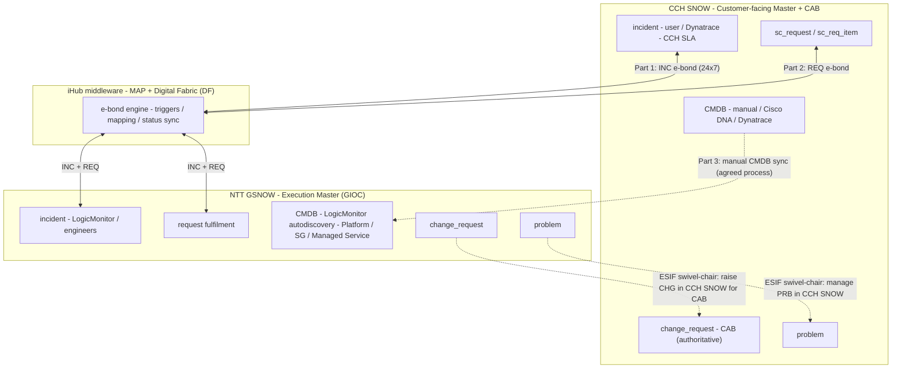
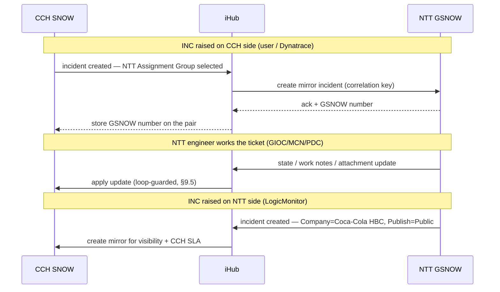
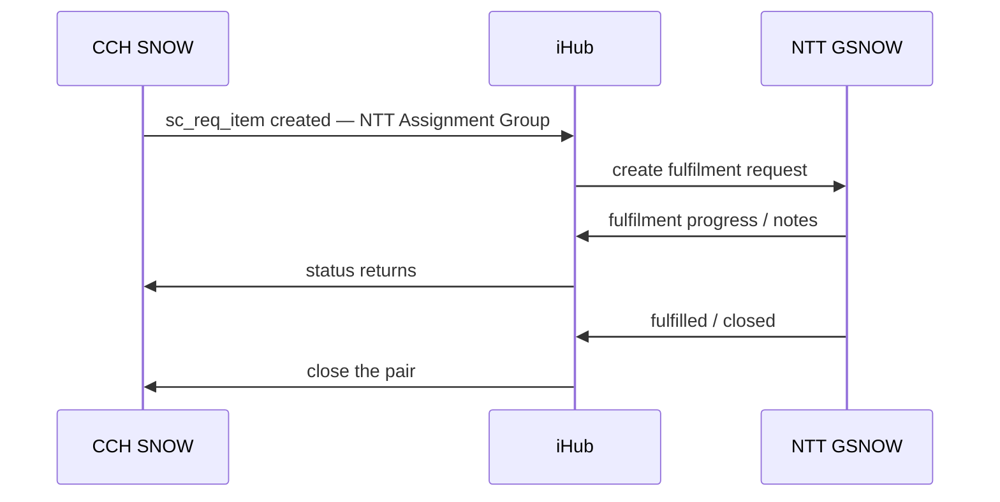
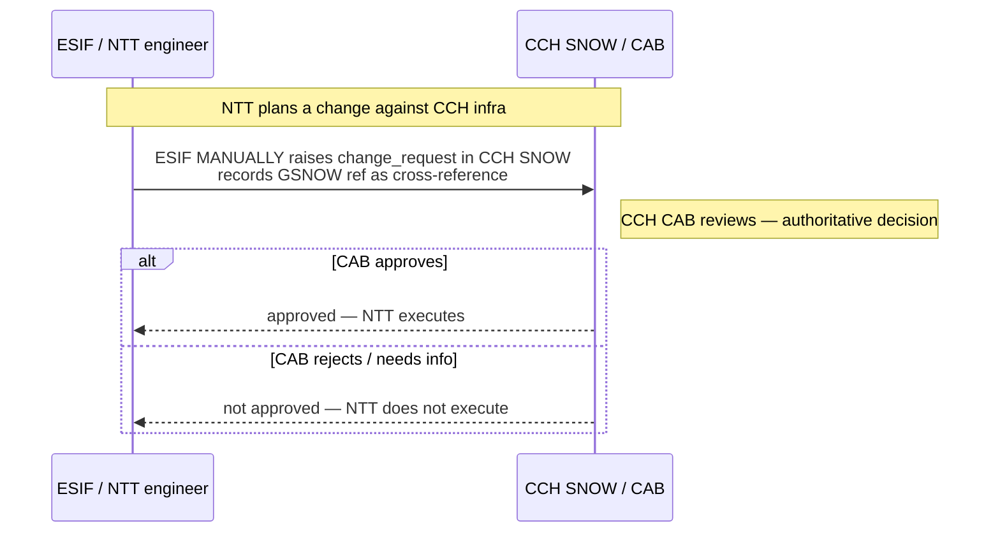

# NTT ↔ CCH ServiceNow Integration — HLD (iHub E-Bond: INC + REQ · Manual CMDB · PRB + CHG Swivel-Chair)

---

## 1. Document Control

**Date**: 2026-06-09 
**Status**: Draft — for team review 
**Author**: Victor Andreev 
**Design principle**: OOTB-first, **per-process integration** over NTT's **iHub** middleware. Automate where volume and 24×7 operation demand it; keep manual where governance and low volume make it acceptable. **CCH ServiceNow ("CCH SNOW") remains the customer-facing system of record**; **NTT ServiceNow ("GSNOW") is the supplier-internal execution layer**. **Incident** and **Request** synchronise **bidirectionally via iHub** (on NTT's Managed Automation Platform + Digital Fabric); **Configuration** is synchronised **manually** per an agreed process (each party owns its own CMDB); **Problem** and **Change** are handled **swivel-chair** by the **ESIF team** into CCH SNOW. CCH retains **CAB authority**; under swivel-chair, ESIF/NTT raises the change in CCH SNOW for CAB approval before executing.

## 2. Sign-offs

| Name | Role |
|---|---|
| | Service Owner — ServiceNow (CCH) |
| | Service Owner — GSNOW (NTT) |
| | Change Manager / CAB Chair (CCH) |
| | Configuration Manager / CSDM Architect (CCH) |
| | Problem Manager (CCH) |
| | Information Security (CCH) |
| | Service Delivery Manager — NTT |
| | Service Desk Lead (Wipro, L1) |

## 3. Introduction

This blueprint defines the **ITSM integration** between **CCH's ServiceNow (CCH SNOW)** and **NTT DATA's ServiceNow (GSNOW)** for the NTT managed-service contract covering CCH network, connectivity, and managed-cloud infrastructure (Cisco, Fortinet, Zscaler, Akamai, Claroty xDome / NAC4OT, and the Azure footprint).

NTT operates through its own existing tooling stack (including GSNOW, iHub, MAP, and Digital Fabric), with controlled integration points to CCH ServiceNow. The integration is delivered over NTT's **iHub** middleware (on the **Managed Automation Platform (MAP)** and **Digital Fabric (DF)**), enabling bidirectional ticket e-bonding so incidents and requests created or updated in one system are synchronised to the other in near real time while each party retains its own platform ownership.

The design is **selective by practice**, matching the integration mechanism to each practice:

| Practice | Mechanism | Owner / detail |
|---|---|---|
| **Incident** | **iHub e-bond** (automated, bidirectional, 24×7) | High volume, time-critical |
| **Request** | **iHub e-bond** (automated, bidirectional) | Standard requests 24×7; rest business-hours |
| **Configuration** | **Manual CMDB sync** (agreed process) | Each party owns its CMDB; CI + Managed Service mandatory on every ticket |
| **Problem** | **Swivel-chair** (manual) | **ESIF team** manages PRB records in CCH SNOW |
| **Change** | **Swivel-chair** (manual) | **ESIF team** raises CHG in CCH SNOW; CAB approves before execution |

> **(TBD — diagram: NTT "Service Operations Model" / overall service model. To be supplied next version.)**

## 4. Scope

### 4.1 In scope

- **Incident** — bidirectional **iHub e-bond** on `incident` (24×7), propagating state, work notes, comments, and attachments
- **Request** — bidirectional **iHub e-bond** on `sc_request` / `sc_req_item`; Standard Requests 24×7, the rest business-hours
- **Configuration** — **manual CMDB synchronisation** following a process agreed by CCH and NTT service-management representatives; CI + Managed Service mandatory on every **NTT-proactively submitted incident**; **(TBD: for reactive incidents originating in CCH and e-bonded to NTT, CI requirement/mapping is not yet finalised.)** NTT structures CIs as Platform → Service Group → Managed Service (§8.5)
- **Problem** — **swivel-chair**: the **ESIF team** manages problem records into CCH SNOW (§9.4)
- **Change** — **swivel-chair**: the **ESIF team** raises changes in CCH SNOW for **CAB approval before execution** (§9.4)
- The shared **correlation/cross-reference**, **conflict resolution**, and **loop prevention** the e-bonded channels require (§8, §9.5)
- The **monitoring/event-source split** and de-duplication rules that govern which tool e-bonds which ticket (§7.5)

### 4.2 Out of scope

- **Dynatrace integration mode** beyond the event/e-bond rules in §7.5 (NTT consuming CCH's tenant per RFP §2.4.1) — separate design
- **Break-glass device-access procedure** (CCH read-only after Service Commencement, SOW §C.9; Attachment H) — context only
- **SOC-level security operations, physical interventions, end-user connectivity, RMA physical receipt** — explicitly NTT-excluded; CCH-retained
- **Automated** Problem and Change synchronisation — deliberately **not** built; ESIF swivel-chair is the agreed model
- **SOM operational content** not part of the integration — backup/continuity, patching, capacity, cloud-account and location inventories — these live in the **Service Operations Manual**, not this HLD

### 4.3 Scope Boundaries

- **OOTB-first** — OOTB INC/REQ/CHG/PRB tables and states are used as shipped; iHub provides the cross-instance transport; no custom core-table schema beyond the correlation/cross-reference and loop-control fields.
- **CCH SNOW is the customer-facing master**; **GSNOW is the execution master**.
- **CAB authority is never delegated** — for any change against CCH infrastructure, CCH CAB approves before NTT executes. Under swivel-chair this is a manual raise-and-approve step.
- **CMDB is owned per-instance, synced manually** — neither side writes directly into the other's CMDB; alignment is a manual, agreed process.
- **Platforms remain as-is** — two ServiceNow instances bridged by iHub. No consolidation, no platform displacement.

## 5. Current State

### 5.1 Two independent ITSM platforms

| Dimension | CCH SNOW | NTT GSNOW |
|---|---|---|
| Purpose | Customer-facing ITSM: user tickets, CMDB, business-impact correlation, SLA reporting to CCH leadership | Supplier-internal ops: GIOC service desk, paging, multi-client portfolio, internal SLA, OEM escalation |
| Ticket origin | User-reported (via Wipro L1); CCH application teams; Dynatrace events | NTT engineers (GIOC/MCN/PDC); LogicMonitor events |
| Change authority | **CCH CAB** — authoritative for any change against CCH infra (SOW §C.7) | NTT plans/executes; no independent authority over CCH infra |
| CMDB | CCH-owned — manual + Cisco DNA + Dynatrace | NTT-owned — LogicMonitor autodiscovery + Managed-Service tagging |
| Monitoring | **Dynatrace** (all CIs) | **LogicMonitor** (contracted CIs, except those not NTT-certified) |
| Service hours | Business as usual | INC 24×7; PRB business-hours; REQ 24×7 standard / BH rest; CHG 24×7 emergency / BH rest (SOW §C.3, SOM coverage model) |
| Device access | Read-only after Service Commencement; break-glass (SOW §C.9) | Read-write on in-scope devices, exclusively |
| Identity | CCH IdP | Client-PAM named accounts — CCH retains identity kill-switch (Attachment H.2) |
| Integration | **None today** — no iHub e-bond; no CMDB sync | **None today** |

### 5.2 Current problems

1. **No cross-instance sync**: the same incident/request is re-keyed by hand; no automated propagation — unsustainable for 24×7 volume. The iHub e-bond addresses this.
2. **No CMDB alignment process**: CCH and NTT each hold a CMDB with no agreed manual sync; CI + Managed Service are not consistently present on tickets.
3. **CAB blind-spot risk**: without a defined procedure, a change NTT plans against CCH infra could execute without surfacing in CCH SNOW for CAB (SOW §C.7).
4. **No common identifier**: nothing links the same ticket across instances; reconciliation is manual.
5. **Status divergence & auto-close mismatch**: the 3-Strike-Rule auto-close timings differ (CCH SNOW 5 days vs GSNOW 7 days) — a ticket can close on one side while open on the other (§8.4).
6. **Duplicate-ticket risk from dual monitoring**: Dynatrace and LogicMonitor can both alert on the same condition; without a de-duplication rule the e-bond would create duplicate incidents (§7.5).
7. **Service-hour asymmetry unmodelled**: INC is 24×7 but PRB/parts of REQ/CHG are business-hours.

## 6. Future State

- **Incident** and **Request** exist in **both** instances; state, work notes, comments, and attachments propagate via **iHub**, matched on a correlation/cross-reference key.
- **Incident** flows both ways, 24×7; **Request** flows both ways (Standard 24×7).
- **Configuration**: each party maintains its own CMDB; an agreed **manual synchronisation** keeps in-scope CIs aligned; **CI + Managed Service are mandatory** on every ticket in either platform.
- **Problem** and **Change** are handled **swivel-chair by ESIF** into CCH SNOW; for Change, ESIF raises the record for **CAB approval before execution** — governance preserved by the manual step.
- **Monitoring is split and de-duplicated**: NTT LogicMonitor and CCH Dynatrace each generate tickets; defined rules prevent double-e-bonding the same condition; CCH Dynatrace tickets for NTT-managed CIs that NTT cannot monitor are e-bonded to NTT, who raise to the vendor where needed.
- The **service-hour model** is explicit per the coverage table (§8.3).

## 7. Solution Design

### 7.1 Two Masters

| Domain | Master | Why |
|---|---|---|
| Customer-facing record, business-impact correlation, CCH-facing SLA | **CCH SNOW** | System of record for CCH's view and customer reporting |
| Change approval (CAB) | **CCH SNOW** | CCH retains CAB authority (SOW §C.7); preserved via the ESIF manual raise step |
| Each instance's CMDB | **The owning instance** | CCH owns CCH SNOW CMDB; NTT owns GSNOW CMDB; sync is a manual agreed process |
| Engineering execution, GIOC service desk, OEM (L4) escalation, internal SLA | **GSNOW** | Where NTT engineers work, across a multi-client portfolio |

### 7.2 Architecture

Solid lines = automated (iHub e-bond); dashed lines = manual (CMDB sync, ESIF swivel-chair).

### 7.3 Integration mechanism per process

| Part | Practice | Direction | Mechanism | Trigger / control |
|---|---|---|---|---|
| **1** | Incident | Bidirectional | iHub e-bond on `incident`, 24×7 | NTT→CCH: `Company=Coca-Cola HBC` + `Publish=Public`. CCH→NTT: NTT **Assignment Group** selected (§11.1) |
| **2** | Request | Bidirectional | iHub e-bond on `sc_request`/`sc_req_item` | Same trigger model as Incident |
| **3** | Configuration | Manual | Agreed CMDB sync process; CI + MS mandatory on tickets | Each party owns its CMDB; manual alignment (§8.5) |
| **SC-A** | Problem | Manual | **ESIF swivel-chair** into CCH SNOW | Low volume; business-hours |
| **SC-B** | Change | Manual | **ESIF swivel-chair** into CCH SNOW | **CAB approves before execution** — authority retained |

**On terminology**: **iHub** is NTT's middleware that performs the cross-instance **e-bond** (on the **Managed Automation Platform** and **Digital Fabric**). **Swivel-chair** means a person (the **ESIF team**) manually re-keys a record into the other instance. The e-bond is **field-scoped** — each side maps a defined field set; neither instance exposes its full schema.

### 7.4 Sync Flow

> **(TBD — diagram: NTT "Ticket Flow" (Service Model §3.1). To be supplied next version.)**

**Incident (Part 1) — bidirectional, 24×7, via iHub:**

**Request (Part 2) — bidirectional, via iHub:**

**Change (swivel-chair) — ESIF raises in CCH SNOW, CAB retained:**

### 7.5 Monitoring & event sources

Two monitoring tools feed the two instances; the e-bond rules prevent duplication:

- **NTT — LogicMonitor (LM)**: monitors all contracted CIs (except those not certified to NTT standards); LM-generated tickets in GSNOW e-bond to CCH SNOW.
- **CCH — Dynatrace**: monitors all CIs; e-bonds tickets to NTT **only** for in-scope CIs that NTT's tools (LM) cannot monitor.
- **De-duplication rule**: CCH does **not** e-bond Dynatrace-generated tickets that relate to NTT's existing monitors — preventing the same condition raising an incident on both sides.
- **Third-party / vendor flow**: for a CI monitored by CCH (e.g. routers), Dynatrace creates a ticket in CCH SNOW → e-bonded to NTT → NTT raises a ticket to the OEM/vendor on CCH's behalf.

> **(TBD — diagram: Event/monitoring flow (LogicMonitor ↔ Dynatrace e-bond + vendor path). To be supplied next version.)**

### 7.6 Why selective integration

The split follows volume × time-criticality × governance:

- **Automate Incident & Request over iHub** — high volume / 24×7; manual re-keying would lose tickets and break SLA.
- **Manual CMDB sync** — each organisation must own and govern its own CMDB; an agreed manual alignment is the contracted approach, with CI + Managed Service mandatory on tickets to keep the two reconcilable.
- **Swivel-chair Problem & Change via ESIF** — low volume, business-hours; for Change the manual raise into CCH SNOW is itself a clean CAB control point, stronger and cheaper than an automated gate. "That is enough."

**The trade-off** is that CMDB, Problem, and Change carry manual steps with a small risk of human omission — mitigated by the CI/MS mandatory rule, the cross-reference fields, and reconciliation reporting (§10.2).

## 8. Requirements

### 8.1 Functional Requirements

| ID | Requirement |
|---|---|
| FR-1 | An incident raised in CCH SNOW with the NTT Assignment Group selected e-bonds to GSNOW via iHub within the Part 1 latency target (§8.2), 24×7 |
| FR-2 | An incident raised in GSNOW with `Company=Coca-Cola HBC` and `Publish=Public` e-bonds to CCH SNOW for visibility and CCH-facing SLA |
| FR-3 | State, work notes, comments, and attachments propagate across each incident/request pair, subject to the field-ownership matrix (§9.5) |
| FR-4 | A CCH-originated service request e-bonds to NTT for fulfilment; status and notes return to CCH |
| FR-5 | **CI and Managed Service are mandatory** on any ticket created in either platform |
| FR-6 | CMDB synchronisation between CCH SNOW and GSNOW follows the agreed **manual** process (§8.5); neither side writes directly into the other's CMDB |
| FR-7 | Each e-bonded ticket pair carries a stable correlation/cross-reference key; create/update is matched on it — no duplicate records |
| FR-8 | A **Problem** is managed swivel-chair by **ESIF** into CCH SNOW, carrying a cross-reference to the GSNOW record |
| FR-9 | A **Change** against CCH infrastructure is raised by **ESIF** in CCH SNOW and **must receive CCH CAB approval before NTT executes**; the GSNOW change carries the CCH change number as cross-reference |
| FR-10 | The monitoring de-duplication rule (§7.5) prevents the same condition e-bonding an incident on both sides |
| FR-11 | The service-hour model (§8.3) is honoured: INC 24×7; Standard Requests 24×7; Emergency Changes 24×7; PRB and the remainder business-hours |
| FR-12 | CCH SNOW is the authoritative source for the CCH-facing SLA clock; NTT internal SLA is tracked separately and not overwritten |

### 8.2 Non-Functional Requirements

| ID | Requirement |
|---|---|
| NFR-1 | **Latency — INC/REQ**: near-real-time via iHub, target ≤ 5 minutes per propagation; INC 24×7. P1 major-incident bridging is time-critical (Decision #8) |
| NFR-2 | **3-Strike-Rule / auto-close alignment**: the auto-close asymmetry (CCH SNOW 5 days vs GSNOW 7 days; Pending-Customer re-activates in GSNOW after 7 days) must not orphan a pair — the e-bond reconciles closure across the seam (§8.4) |
| NFR-3 | **Volume**: multi-thousand-CI estate; INC volume dominated by LM/Dynatrace events; sized against the de-duplicated event rate |
| NFR-4 | **Idempotency**: re-send of the same record produces no duplicate; pairs match on the correlation/cross-reference key |
| NFR-5 | **Audit**: every iHub write is traceable in each instance's `sys_audit`; swivel-chair and manual-CMDB actions carry the cross-reference on both sides |
| NFR-6 | **Error handling**: retries with backoff; remediation queue; store-and-forward over an iHub outage; reconciliation job (§9.6) |
| NFR-7 | **Loop prevention**: each iHub write is tagged with its originating instance; the receiver suppresses echo updates |
| NFR-8 | **Security**: mutual authentication, scoped integration accounts, IP allow-listing; CCH retains the PAM identity kill-switch over NTT access (Attachment H.2) |

### 8.3 Service Coverage, Hours & Escalation

**Coverage / service-hour model** (Full Coverage 24×7; DR Coverage; Non-production as a pricing option under Full Coverage):

| Process | Hours |
|---|---|
| Monitoring / Event Management | 24×7 |
| Incident Management | 24×7 |
| Problem Management | Business-hours |
| Service Request Fulfilment | 24×7 for **Standard Requests**; business-hours for the rest |
| Change Management | 24×7 for **Emergency Changes** (incident-related); business-hours for the rest |
| Capacity & Availability | Business-hours (usage/performance monitoring 24×7) |
| Patch Management | 24×7 |

**Tiered support & escalation:**

| Level | Owner | Notes |
|---|---|---|
| L1 (CCH intake) | **Wipro** (CCH service desk) | User-facing intake on the CCH side |
| L1 (NTT) | **GIOC** (Global Integrated Operations Center, 24×7) | NTT service desk / SPOC |
| L2 | **NTT Service Delivery Manager** (business-hours) | |
| L3 | **NTT MCN** (network), **NTT PDC** (security), **MEA POD6** | MNS network ops; PDC security ops |
| L4 | **OEMs** (Cisco, Fortinet, Zscaler, Claroty, Akamai) | NTT acts on behalf of CCH for OEM ticketing |

> **(TBD — diagram: Escalation hierarchy (CCH + NTT). To be supplied next version.)**

NTT GIOC service-desk SPOC: phone **+41 43 210 7366**, mailbox **CCHBC@support.global.ntt.ms**. Individual named escalation contacts and the hierarchical-escalation timeline (0–1h / 1–3h / 3–4h) are maintained in the **SOM / ServiceNow customer contacts** — **(TBD: live contact details — see ServiceNow customer contacts)**.

### 8.4 State Model Mapping & 3-Strike-Rule Behaviour

The two instances run their own state values; iHub maps both onto a shared lifecycle. Exact per-instance values confirmed during build (Decision #5):

| Canonical stage | CCH SNOW | GSNOW | Notes |
|---|---|---|---|
| New / Logged | New | New / Registered | Created either side; correlation key minted |
| In Progress | In Progress | Assigned / WIP | |
| Pending / On Hold | On Hold (reason code) | Pending (mapped) | Reason codes mapped, not free-text |
| Resolved / Fulfilled | Resolved / Closed Complete | Resolved / Fulfilled | Propagates both ways |
| Closed | Closed | Closed | SLA clocks stopped per side |

**3-Strike-Rule (3 SR) / auto-close** — the 3 SR auto-close button is disabled on GSNOW INC and RITM (two standard notices). **Pending-Customer** in GSNOW re-activates the ticket after **7 days**. **CCH SNOW auto-closes after 5 days** (3 SR); **GSNOW auto-closes after 7 days** (configured in **Digital Fabric**). The e-bond must reconcile this **5-vs-7-day asymmetry** so a pair does not close on one side while open on the other (NFR-2).

### 8.5 CMDB Ownership & Manual Synchronisation (Configuration)

Each party **owns and manages its own CMDB**; cross-instance synchronisation is **manual**, following a process agreed by CCH and NTT service-management representatives. **CI + Managed Service are mandatory** on every ticket in either platform, which keeps the two CMDBs reconcilable.

**NTT GSNOW CMDB structure** — CIs are organised as **Platform (PL) → Service Group (SG) → Managed Service (MS)**, with **Cloud Accounts (CLA)** assigned to platforms. Population is via **LogicMonitor autodiscovery + Managed-Service tagging**: a CI tagged with the correct Managed Service appears in GSNOW with `Status=Discovered`, in the correct Platform/Service Group, with managed services configured. Illustrative platforms:

| Platform (PL) | Contents |
|---|---|
| Sitepod | NTT tooling (LogicMonitor, XTAM, Salt, Ansible) |
| CCHBC Network Enhanced Production | NW Appliances + PaaS (CLA: Azure) |
| CCHBC OT Network | NW Appliances + PaaS (OT) |
| CCHBC Network | NW Appliances + PaaS |
| CCHBC SRA 2021 Production | NW Appliances + PaaS |
| Networking | On-prem NW appliances and consoles |

**CCH SNOW CMDB** — populated via CCH's existing pipes (manual + Cisco DNA + Dynatrace). The manual sync aligns the in-scope CIs across the two instances.

> **(TBD — diagram: CMDB structure (Platform → Service Group → Managed Service → CLA) and CI↔Managed-Service tagging. To be supplied next version.)**

### 8.6 Open Design Decisions

| # | Question | Status |
|--:|---|---|
| 1 | E-bond transport | **RESOLVED — NTT iHub middleware (MAP + Digital Fabric)** |
| 2 | CMDB manual-sync process — cadence, ownership-per-class, reconciliation cycle | OPEN — agree with CCH + NTT service management |
| 3 | Attachment propagation — full binary vs link-back? | PROPOSED — link-back with size threshold; binary for evidence under N MB |
| 4 | Field-ownership matrix for INC/REQ (§9.5) | PROPOSED — draft in §11.1; ratify with both SN owners |
| 5 | State map — confirm against real per-instance state values | PROPOSED — §8.4 |
| 6 | Swivel-chair traceability — mandatory cross-reference + reconciliation report for PRB/CHG | PROPOSED — yes; manual omission is the main swivel-chair risk (§10.2) |
| 7 | Out-of-hours handling for the business-hours processes | OPEN — derive from the agreed business-hours calendar |
| 8 | Major-incident (P1) bridging across instances | OPEN — time-critical; affects NFR-1/NFR-3 |
| 9 | Cross-instance CI reference for business impact (NTT CI ↔ CCH application, e.g. SAP) | OPEN — via the manual CMDB alignment (§8.5) |

## 9. Implementation

### 9.1 Part 1 — Incident E-Bond (iHub)

1. Confirm iHub connectivity (PRE and PRO) per the transition plan (§10.1)
2. Provision scoped integration accounts; establish mutual auth and IP allow-listing (§11.4)
3. Add correlation/cross-reference and source-tag fields to `incident` on both instances
4. Configure the triggers — CCH→NTT on NTT Assignment Group; NTT→CCH on `Company=Coca-Cola HBC` + `Publish=Public`
5. Implement the state map (§8.4) and the field-ownership matrix (§9.5)
6. Configure attachment/work-note propagation (Decision #3)
7. End-to-end test in PRE: raise on CCH → mirror in GSNOW → NTT updates → CCH reflects; raise on NTT (LM) → CCH mirror with CCH SLA; verify no duplicates, no loop, correct 3 SR / auto-close behaviour

### 9.2 Part 2 — Request E-Bond (iHub)

1. Add correlation/cross-reference and source-tag fields to `sc_request`/`sc_req_item`
2. Implement the REQ state map and the Standard-Request 24×7 vs business-hours distinction
3. Wire bidirectional create + status return via iHub
4. End-to-end test in PRE: raise request on CCH → GSNOW fulfilment → progress returns → close pair

### 9.3 Part 3 — Manual CMDB Synchronisation

1. Agree the manual sync process, cadence, and per-class ownership with CCH + NTT service management (Decision #2)
2. Enforce **CI + Managed Service mandatory** on tickets in both platforms
3. NTT: confirm LogicMonitor autodiscovery + Managed-Service tagging populates GSNOW (Platform/SG/MS) correctly
4. CCH: maintain CCH SNOW CMDB via existing pipes; align in-scope CIs to GSNOW at the agreed cadence
5. Periodic manual review/alignment of the in-scope CI set across the two instances

### 9.4 Problem & Change — ESIF Swivel-Chair

**Problem**: the **ESIF team** manages problem records into CCH SNOW, recording a cross-reference to the GSNOW record (and vice-versa).

**Change**: the **ESIF team** **manually raises a `change_request` in CCH SNOW** for CAB, recording the GSNOW change number as cross-reference. **NTT executes only after CCH CAB approval.** A periodic reconciliation report (Decision #6) flags GSNOW changes lacking a CCH cross-reference — the guard against the manual step being skipped. NTT stakeholders represented at CAB include the NTT SDM and NTT Support-Engineer TL; **change-freeze periods** (e.g. Christmas, Dec 15–Jan 6) are honoured.

### 9.5 Conflict Resolution & Loop Prevention (e-bonded channels)

**Field-ownership matrix** — each field has one authoritative writer; the non-owner's edits are not propagated:

| Field group | Authoritative writer |
|---|---|
| Customer-facing description, caller, business service, CCH-facing priority | CCH SNOW |
| Engineering work notes, resolution detail, OEM case refs, NTT internal assignment | GSNOW |
| State / resolution state | Shared per the state map (§8.4); transitions validated, not blind-copied |
| CI + Managed Service | Mandatory; aligned via the manual CMDB process |

**Loop prevention** — every iHub write carries a source-instance tag; the receiver applies it but does not re-emit, breaking the echo. Update ordering per ticket is preserved.

### 9.6 Error Handling

| Class | Response | Notes |
|---|---|---|
| `429` / `5xx` | Retry with exponential backoff; cap at N; alert if cap reached | Surface to remediation queue |
| `4xx` (other) | No retry — log and route to manual remediation | Payload/auth/mapping issue |
| iHub outage | Store-and-forward; replay on recovery (idempotent) | No ticket lost; ordering preserved |
| Auto-close mismatch (3 SR) | Reconciliation aligns closure across the 5-vs-7-day seam | NFR-2 |
| Drift (pairs diverge) | Periodic reconciliation by correlation/cross-reference key | Catches missed updates + skipped manual steps |
| All errors | Log with correlation/cross-reference key | Match both instances' `sys_audit` |

## 10. Planning and Risk Management

### 10.1 Planning — Transition (PRE → PRO)

**Preparation**:
- Define the ticket flows (CCH→NTT and NTT→CCH) and complete the **mapping files** — ticket status and the INC/REQ field set
- **CMDB**: manual review, discussion, and alignment
- **PRE environments**: CCH creates its test environment; NTT uses its defined PRE; iHub PRE stood up

**Connectivity**:
- CCH PRE ↔ NTT iHub PRE
- CCH PRO ↔ NTT iHub PRE

**Code generation (PRE)**: CCH generates the e-bond code in CCH SNOW; NTT generates the e-bond code in iHub.

**Testing (PRE)**: run the defined flows; fix and re-test until the integration supports them.

**Go-Live**: move code to PRO; agree date/time; go-live verification testing.

**Phasing**: Phase 1 — Incident e-bond; Phase 2 — Request e-bond; Configuration manual sync and ESIF swivel-chair live from Service Commencement. Aligns with the contractual transition (e.g. Guardicore onboarding 1 Nov 2026; **parallel run Jan 2027, no SLA** — the window to prove the e-bond).

**Pre-go-live gates**:
1. iHub PRE/PRO connectivity established
2. Mapping files (status + fields) complete and tested
3. CMDB manual-sync process agreed (Decision #2)
4. Swivel-chair procedure documented with cross-reference + reconciliation report (Decision #6)
5. Loop prevention, idempotency, and 3 SR auto-close behaviour tested
6. Scoped integration accounts provisioned; PAM kill-switch confirmed (§11.4)

### 10.2 Risk Register

| Risk | Impact | Mitigation |
|---|---|---|
| **Swivel-chair Change skipped** — NTT executes without raising in CCH SNOW | Change without CAB approval — governance breach (SOW §C.7) | Mandatory cross-reference + reconciliation report flagging GSNOW changes with no CCH match (Decision #6) |
| Duplicate incidents from dual monitoring (LM + Dynatrace) | Noise, double SLA | De-duplication rule (§7.5) — CCH does not e-bond Dynatrace tickets tied to NTT monitors |
| 3 SR auto-close asymmetry (5 vs 7 days) | Pair closes on one side, open on the other | Reconciliation aligns closure across the seam (NFR-2, §8.4) |
| CMDB drift (manual sync) | In-scope CIs diverge across instances | CI + MS mandatory on tickets; agreed cadence + periodic manual review (Decision #2) |
| Update loop (ping-pong) | Infinite updates, audit noise | Source-instance tagging; receiver suppresses echo (NFR-7) |
| Simultaneous-edit conflict | Silent last-writer-wins loss | Field-ownership matrix (§9.5) |
| iHub outage | Tickets stop syncing | Store-and-forward + idempotent replay + reconciliation (§9.6) |
| Attachment loss / size limits | Evidence missing on one side | Link-back + size policy (Decision #3) |
| SLA-clock conflation | Wrong CCH-facing SLA under soft SLA regime | CCH SNOW owns CCH-facing clock (FR-12) |
| Major-incident (P1) bridge undefined | Slow coordination on the most time-critical tickets | Decision #8 — design the ESIF/GIOC bridge |
| Cross-org credential / tenant exposure | Security incident spanning both platforms | Mutual auth, scoped accounts, IP allow-list, PAM kill-switch (Attachment H.2) |

## 11. Appendix

### 11.1 Data mapping

#### 11.1.1 Incident field map (Part 1) — illustrative

Confirmed against real per-instance fields during build; mapping files completed in transition (§10.1). Authoritative writer per §9.5.

| # | Logical field | CCH SNOW `incident` | GSNOW `incident` | Authoritative writer |
|---:|---|---|---|---|
| 1 | Correlation / cross-reference | `correlation_id` | `correlation_id` | iHub (minted once) |
| 2 | Trigger — CCH→NTT | `assignment_group` (NTT group) | — | CCH SNOW |
| 3 | Trigger — NTT→CCH | — | `company=Coca-Cola HBC` + `publish=Public` | GSNOW |
| 4 | Short description | `short_description` | `short_description` | Origin at create |
| 5 | Caller / customer | `caller_id` | mapped contact | CCH SNOW |
| 6 | Priority (CCH-facing) | `priority` | mapped | CCH SNOW |
| 7 | State | `state` (mapped, §8.4) | `state` (mapped) | Shared — validated |
| 8 | **CI** | `cmdb_ci` (mandatory) | CI (mandatory) | Aligned via manual CMDB sync |
| 9 | **Managed Service** | mapped (mandatory) | Managed Service (mandatory) | NTT structure (§8.5) |
| 10 | Work notes | `work_notes` | `work_notes` | Both — appended, source-tagged |
| 11 | Attachments / OEM refs | `sys_attachment` | `sys_attachment` | Both — per Decision #3 |
| 12 | Resolution | `close_notes` / `close_code` | mapped | NTT authors; propagates |
| 13 | Source-instance tag | `x_ebond_source` | `x_ebond_source` | Writing side (loop control) |

#### 11.1.2 Request field map (Part 2) — illustrative

Mirrors the Incident map; `sc_req_item` ↔ GSNOW request; CI + Managed Service mandatory; Standard Requests 24×7.

#### 11.1.3 Swivel-chair cross-reference (Problem & Change)

| Practice | CCH SNOW field | GSNOW field | Purpose |
|---|---|---|---|
| Problem | foreign PRB number | foreign PRB number | Manual link (ESIF) |
| Change | foreign CHG number | foreign CHG number | Manual link; reconciliation flags missing CCH match (Decision #6) |

### 11.2 NTT GSNOW CMDB structure (reference)

Platform → Service Group → Managed Service; CLAs assigned to platforms; autodiscovery via Managed-Service tagging (§8.5). Cloud accounts are Azure (West EU / North EU). Detailed Platform/SG/MS/CLA inventory is maintained in the **SOM** — **(TBD: full CMDB inventory — see SOM Appendix.)**

### 11.3 Escalation (reference)

Structure in §8.3; GIOC SPOC: **+41 43 210 7366**, **CCHBC@support.global.ntt.ms**. Hierarchical-escalation timeline (0–1h GIOC out-of-hours; 1–3h Line/Ops Manager; 3–4h Ops Director / COO) and named contacts — **(TBD: see SOM / ServiceNow customer contacts.)**

### 11.4 Security components

| Purpose | Scope | Authentication |
|---|---|---|
| CCH-side e-bond account | Read/write on `incident`, `sc_request`/`sc_req_item` (mapped fields) | OAuth 2.0 / mTLS |
| NTT iHub account | Read/write on GSNOW INC/REQ (mapped fields) | OAuth 2.0 / mTLS |

Distinct accounts so cross-instance writes are attributable; IP allow-listing between CCH SNOW, iHub, and GSNOW. CCH retains the **PAM identity kill-switch** over NTT access (Attachment H.2). Loop guard: a business rule on each side rejects re-emission of a write carrying the foreign source-instance tag.

### 11.5 Plugins

OOTB-leaning on the CCH side: OOTB `incident`, `sc_request`/`sc_req_item`, `change_request`, `problem` tables and states; OOTB `sys_audit`; correlation/cross-reference and source-tag fields (the only added fields). Transport is NTT **iHub** (MAP + Digital Fabric) — NTT-side platform, no CCH plugin.

### 11.6 References

- NTT DATA Statement of Work v2.0 (28 April 2026) — §C.3 (service hours), §C.7 (CAB authority), §C.9 (co-management), §2.6.4 (CMDB), Attachment H.2 (PAM), Attachment I (SLA)
- CCH Network Management & Connectivity Services RFP v1.1 (Sept 2025) — §2.4.1 (Dynatrace), §2.6.4 (CMDB)
- NTT **Service Operations Manual** (Coca-Cola HBC) — source for the iHub integration, monitoring split, CMDB structure, escalation, coverage model, and transition method
- ServiceNow Docs — `incident`, `sc_request`/`sc_req_item`, `change_request`, `problem` tables and states
- Referenced SOM diagrams not yet supplied — **(TBD: Ticket Flow, Service Operations Model, Escalation hierarchy, CMDB structure, Monitoring/event flow.)**
