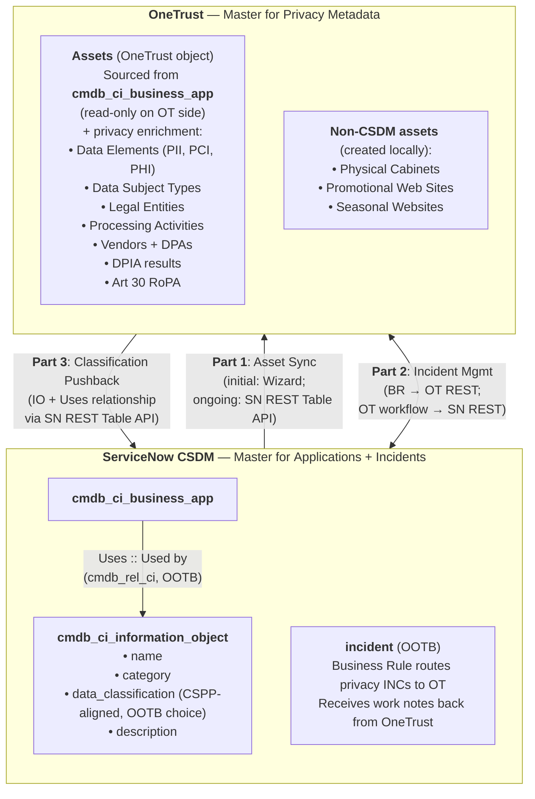
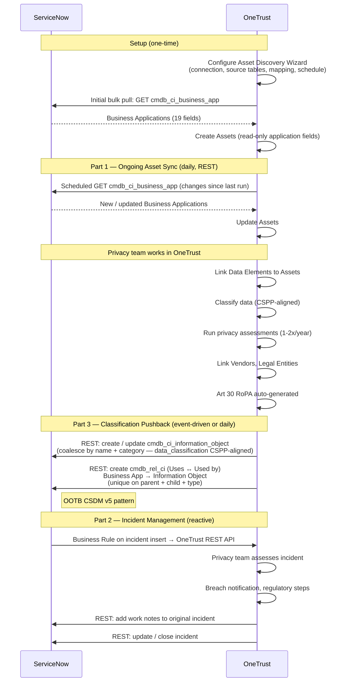

# OneTrust ↔ CSDM Integration — HLD (OOTB-Only)

**Date**: 2026-05-13<br>
**Status**: Draft — for team review<br>
**Author**: Victor Andreev<br>
**Design principle**: OOTB-first. The integration favours out-of-the-box ServiceNow CSDM v5 classes, fields, and relationships on every layer where the OOTB pattern delivers equivalent or better outcomes than a custom alternative.<br>

---

## 1. Introduction

This blueprint defines how the **ServiceNow CMDB / CSDM** integrates with **OneTrust** (the licensed Privacy Product) to satisfy **GDPR Article 30** requirements (Records of Processing Activities).

The integration is OOTB-first on the ServiceNow side. Classification information returning from OneTrust lands in `cmdb_ci_information_object` records linked to Business Applications via OOTB `Uses ↔ Used by` relationships — the canonical CSDM v5 pattern for data classification.

Applications containing personal data are maintained in OneTrust's **Data Mapping Automation** module — at Group (CSC, DTPS, BSO) and BU levels. These applications and their related Business Processes, Vendors, Personal Data, and Legal Entities are reviewed once or twice per year (depending on criticality) by business process owners, DTPS product managers, and Vendors.

OneTrust and CSDM operate today as **independent inventories** with no automated sync, leading to discrepancies that directly impact GDPR Article 30 compliance.

## 2. Scope

### In scope

- Establish CSDM as the master system for application records consumed by OneTrust
- OOTB sync mechanism between CSDM and OneTrust (Asset Discovery Wizard for initial pull; SN REST Table API for ongoing pulls and for writeback)
- Map CSDM application fields to OneTrust Asset attributes
- Define how data classification flows back from OneTrust to ServiceNow using `cmdb_ci_information_object` + `Uses ↔ Used by` relationships
- Align classification values to **CSPP Confidentiality Levels**
- Address GDPR Art 30 inventory completeness, including asset types not covered by CSDM (Physical Cabinets, Promotional Websites)
- Define the incident-management integration in both directions (privacy-related incidents from SN → OneTrust → work notes back to SN)

### Out of scope

- CSDM core schema changes (the integration adds data, not schema)
- Enterprise Architecture tool integration (treated as a separate workstream; not coupled to this design)
- Business Process alignment with Signavio Processes (dependency on Signavio data model)
- Vendor management integration (separate workstream)
- Privacy Impact Assessment (PIA) workflow design within OneTrust
- Changes to CSDM Phase 1 core product codebase

## 3. Current State

### Two independent inventories

| Dimension | OneTrust (Privacy Product) | ServiceNow CSDM |
|---|---|---|
| Purpose | GDPR Art 30 compliance (Records of Processing Activities) | IT service management, incident routing, portfolio governance |
| Application source | Created manually by BU and CSC business owners | Manual + PowerBI imports; no automated sync from EA tools |
| Review cycle | 1–2× per year (criticality-based) by business process owners | Continuous — Business Rules, MyID sync, manual updates |
| Taxonomy | Privacy-specific (Data Elements, Data Subjects, Legal Entities, DPIAs) | CSDM fields (lifecycle stage, architecture type, platform) |
| Asset coverage | Applications + Physical Cabinets + Promotional / Seasonal Websites | Applications only |
| Data classification | Maintained via Data Elements + Data Classification on Assets | Not populated — `cmdb_ci_information_object` is empty in CCH today |
| Governance | Privacy team + DTPS product managers | CSDM team + Product Model owners |
| Platform | OneTrust SaaS (licensed) | ServiceNow SaaS |
| Connector status | OneTrust ServiceNow Store app withdrawn — pull-side uses OOTB Asset Discovery Wizard for initial config; ongoing via SN REST Table API | N/A |

### Current problems

1. **Field-level discrepancies**: lifecycle status diverges between systems (e.g., app marked decommissioned in OneTrust but active in CSDM). Directly impacts GDPR Art 30 inventory accuracy.
2. **Incomplete CSDM coverage**: CSDM does not maintain Physical Cabinets, Promotional Web Sites, or Seasonal Websites. Directly impacts GDPR Art 30 inventory completeness.
3. **Shadow IT risk**: applications created in OneTrust by BU and CSC owners can be Shadow IT — missing DTPS governance.
4. **Process mismatch**: OneTrust Business Processes do not map cleanly to Signavio Process levels.
5. **No unique identifier**: no common key links the same application across both systems; reconciliation is manual.
6. **No data classification in CSDM**: `cmdb_ci_information_object` is empty in CCH today. ServiceNow cannot answer "which Business Applications process personal data?".
7. **Store connector withdrawn**: OneTrust's "OneTrust for ServiceNow" Store app no longer exists; the classification-pushback capability that was packaged in it is gone.

## 4. Future State — Picture of Success

- Applications are **not created** in OneTrust. They are pulled from CSDM — initial bulk pull configured via the OneTrust **Asset Discovery Wizard**; ongoing delta sync via scheduled SN REST Table API calls.
- Privacy team enhances the OneTrust inventory with Data Elements, Legal Entities, DPIAs — work that has always belonged in OneTrust.
- Data classification is **maintained in OneTrust** (the privacy team's working environment) and **written back to ServiceNow** as `cmdb_ci_information_object` records linked to Business Applications via `Uses ↔ Used by` relationships.
- Classification values aligned to **CSPP Confidentiality Levels**.
- ServiceNow can answer "which Business Applications process personal data?" via the OOTB two-step CMDB query pattern (see §11.4).
- Asset types not in CSDM (Physical Cabinets, Promotional / Seasonal Websites) remain creatable in OneTrust only; all other application creation is blocked there.
- Privacy-related incidents flow from ServiceNow to OneTrust via Business Rule; resolutions and work notes flow back from OneTrust to ServiceNow via REST API.

## 5. Solution Design

### 5.1 Two Masters

| Domain | Master | Why |
|---|---|---|
| Applications — what apps exist, who owns them, lifecycle | **ServiceNow CSDM** | IT service management, portfolio governance, single source of truth for application existence |
| Privacy metadata — what data they process, classification, legal basis, assessments | **OneTrust** | Privacy team works there; assessments happen there; Art 30 RoPA generated there |

### 5.2 Architecture



### 5.3 Integration Parts Summary

| Part | Direction | Mechanism | ServiceNow-side work |
|---|---|---|---|
| **1. Asset Sync** | OneTrust pulls from SN | **Initial bulk pull** configured via the OneTrust Asset Discovery Wizard. **Ongoing sync** via OneTrust-scheduled REST Table API calls to `cmdb_ci_business_app` | Service account with read access to `cmdb_ci_business_app` |
| **2. Incident Management** | SN → OneTrust → SN | OOTB Business Rule on the SN `incident` table; OneTrust SN Incident Management workflow on the OT side; reverse leg via SN REST Table API | Business Rule on OOTB `incident` table; service account for the reverse work-notes leg |
| **3. Classification Pushback** | OneTrust → SN | OneTrust calls the SN REST Table API directly — writes to OOTB CSDM v5 tables (`cmdb_ci_information_object`, `cmdb_rel_ci`) using the OOTB `Uses::Used by` relationship type | OOTB CSDM v5 tables; IRE rule on `cmdb_ci_information_object` for coalescing (see §7.3) |

**On terminology**: the **integration mechanism** is the SN REST Table API on the ServiceNow side and the OneTrust REST API on the OneTrust side. The **Asset Discovery Wizard is a OneTrust-side configuration tool** used during initial setup to define the connection, source table, field mapping, and schedule — once configured, the Wizard is not in the runtime path; OneTrust's scheduler drives all subsequent calls over REST.

### 5.4 Sync Flow

End-to-end flow (Mermaid sequence diagram extracted to [`../diagrams/blueprints/ootb-sync-flow.mmd`](../diagrams/blueprints/ootb-sync-flow.mmd)):



### 5.5 Why Information Objects

The OOTB CSDM v5 mechanism for data classification is the **Information Object** class (`cmdb_ci_information_object`). Each record represents a *type of data* (e.g., "Customer PII", "Credit Card Data", "Health Records"). The link to a Business Application is a `Uses ↔ Used by` CMDB relationship.

Available since the New York release. CSDM v5 Domain 3 (Design & Planning). Key field: `data_classification` — OOTB choice list with values Public, Internal, Confidential, Restricted, Highly Sensitive — directly compatible with CSPP.

**Why this pattern fits**:

- **Schema stability** — Information Objects are data, not schema. The integration adds records, not columns, so future ServiceNow upgrades, Store-app installations, and CSDM model migrations leave the design unchanged.
- **Many-to-many is native** — One app can use multiple data types (PII + Financial + Health); one data type is used by many apps. A CMDB relationship models this naturally; querying "which apps process PII" follows the OOTB graph traversal.
- **Reusable across consumers** — Once classification lives in IOs, any consumer (privacy reports, GDPR Art 30 RoPA, CMDB-Health dashboards, future integrations) reads from the same OOTB pattern.
- **CSDM-canonical** — The CSDM team's documented mechanism. Tooling around Information Objects (relationship discovery, dashboards, queries) is already on the ServiceNow roadmap.

**Starting condition — IO table is empty at CCH today**: not a blocker. The OneTrust integration is what populates `cmdb_ci_information_object`: every classification OneTrust pushes back creates / updates an IO record and a relationship. The integration drives CCH's CMDB to Fly-stage maturity for data classification organically, as a side-effect of routine privacy operations.

### 5.6 OneTrust workflow on classification — operational detail

When a privacy assessment in OneTrust classifies an asset:

1. **OneTrust determines the data type** (e.g., "Customer Email Address" → category PII). Granularity is **per data type**, not per category — one IO per "Customer Email Address", not one IO per "PII".
2. **OneTrust REST call → ServiceNow** (`cmdb_ci_information_object` table):
   - **Coalesce key**: composite of `name` + `category` (the IRE rule on `cmdb_ci_information_object` enforces this; primary key `name`, secondary discriminator `category`)
   - If absent: create new IO record with `name`, `category`, `description`, `data_classification` (CSPP value)
   - If present: update `data_classification` if changed
3. **OneTrust REST call → ServiceNow** (`cmdb_rel_ci` table):
   - **Relationship uniqueness**: enforce uniqueness on the composite `parent + child + type` — one and only one `Uses::Used by` row may exist between any (Business App, Information Object) pair
   - If absent: create relationship with type `Uses::Used by` (OOTB type)
   - If present: no-op
4. **Audit trail**: each REST call logged in `sys_audit` per ServiceNow OOTB behaviour

All operations target OOTB CMDB tables (`cmdb_ci_information_object`, `cmdb_rel_ci`) and use the OOTB `Uses::Used by` relationship type. OneTrust calls the SN REST Table API directly — no SN-side middleware. The IRE is used only for IO coalescing.

## 6. Stakeholder Requirements

### 6.1 Application ↔ Data Relationship

| Question | Answer |
|---|---|
| What is the defined architecture for Application and Data content? | Two masters: CSDM for applications, OneTrust for data classification. Connected via Asset Discovery Wizard (initial config) + SN REST Table API (ongoing pull and writeback to OOTB Information Object tables). |
| What is the target system to maintain those relationships? | OneTrust maintains Application ↔ Data relationships in its native model. CSDM receives classification back as Information Objects linked via OOTB `Uses` relationships. |
| Where does data classification live in ServiceNow? | On `cmdb_ci_information_object` records (the OOTB CSDM v5 mechanism for data classification), linked to Business Applications via OOTB `Uses ↔ Used by` relationships. The `data_classification` Choice field on these IO records is CSPP-aligned. |
| Can this be aligned to CSPP Confidentiality Levels? | Yes — the OOTB `data_classification` choice list maps directly to CSPP: Public, Internal, Confidential, Restricted, Highly Sensitive. |

### 6.2 Sync Alternatives

#### Alternative 1 — Filtered Sync

Pull only privacy-relevant applications from CSDM into OneTrust.

**Problem**: filtering requires classification to exist in CSDM *before* the pull — but classification comes from OneTrust *after* the pull. Creates a circular dependency unless CSDM is pre-populated with classification data from another source.

#### Alternative 2 — Full Sync (resolved)

Pull all CSDM Business Applications into OneTrust.

| Step | Action | Trigger |
|---:|---|---|
| 1 | Applications already in OneTrust → one-time pull from CSDM, matched on `sys_id` (see Decision #4) | One-time migration |
| 2 | All remaining CSDM applications → pulled into OneTrust as-is | One-time bulk sync |
| 3 | Privacy team assessments scope only the relevant subset within OneTrust | Ongoing |

**Why Alt 2** (resolved): no circular dependency. Pull everything, classify in OneTrust, push classification back. Filtering happens *inside OneTrust* (privacy assessments scope only relevant apps), not at the sync level.

### 6.3 Shared Requirements (apply to both Alternatives)

| # | Requirement | Implementation |
|---|---|---|
| 1 | All new CSDM applications automatically created in OneTrust | OneTrust scheduler runs the configured pull (e.g., daily) over the SN REST Table API |
| 2 | OneTrust blocks creation of new applications by end users | OneTrust configuration — disable manual asset creation for the application asset type |
| 3 | OneTrust allows creation of non-CSDM assets (Physical Cabinets, Websites) | OneTrust configuration — allow manual creation only for non-CSDM asset types |
| 4 | Privacy team updates only applications linked to business processes and personal data | OneTrust governance — assessments scoped to assets with Data Element links |

## 7. Data Model

### 7.1 CSDM → OneTrust — fields synced (Part 1)

Read-only on the OneTrust side. CSDM is the master.

| # | OneTrust Asset Attribute | CSDM Source | Notes |
|---:|---|---|---|
| 1 | Name | `cmdb_ci_business_app.name` | Primary identifier |
| 2 | Business Criticality | `cmdb_ci_business_app.business_criticality` | OOTB (1-4) |
| 3 | Product | `cmdb_application_product_model.product` (via `model_id`) | Definition with OneTrust pending |
| 4 | Platform | `cmdb_ci_business_app.platform` | Definition with OneTrust pending |
| 5 | Application Type | `cmdb_ci_business_app.application_type` | OOTB enum |
| 6 | Install Type | `cmdb_ci_business_app.install_type` | OOTB enum (IaaS / PaaS / SaaS / On-Prem) |
| 7 | Platform Host | `cmdb_ci_business_app.platform_host` | OOTB |
| 8 | Life Cycle Stage | `cmdb_ci_business_app.life_cycle_stage` | OOTB CSDM v5 — Plan / Build / Operate / Retire / Decommission |
| 9 | Life Cycle Stage Status | `cmdb_ci_business_app.life_cycle_stage_status` | OOTB sub-status |
| 10 | Business Owner | `cmdb_ci_business_app.business_owner` | `sys_user` reference |
| 11 | Description | `cmdb_ci_business_app.short_description` | OOTB |
| 12 | IT Application Owner | `cmdb_ci_business_app.it_application_owner` | `sys_user` reference |
| 13 | Install Status | `cmdb_ci_business_app.install_status` | OOTB enum |
| 14 | Operational Status | `cmdb_ci_business_app.operational_status` | OOTB enum |
| 15 | Updated | `cmdb_ci_business_app.sys_updated_on` | OOTB system field |
| 16 | Vendor | `cmdb_ci_business_app.vendor` (core_company ref) | Currently sparse in CSDM — population is an open decision |
| 17 | Owned by (Company) | `cmdb_ci_business_app.company` | OOTB — BU / Group |
| 18 | Support Group | `cmdb_ci_business_app.support_group` | OOTB |
| 19 | Sys ID | `cmdb_ci_business_app.sys_id` | Round-trip identifier (Decision #4 — `sys_id`, resolved) |

**Note on filter scoping**: Phase-1 filtering between "centrally managed" and "locally managed" applications is data-driven — derived from existing OOTB attributes (`company`, `support_group`, or `business_unit` if populated). The choice of source attribute is Open Decision #12.

### 7.2 OneTrust-only attributes (not synced from CSDM)

Maintained exclusively in OneTrust by the privacy team:

- Data Elements (personal data types and categories)
- Data Classification (CSPP-aligned values)
- Data Subject Types
- Legal Entities
- Processing Activities (business processes)
- Vendors + Data Processing Agreements
- DPIA status and results
- Data retention periods
- Transfer records (cross-border)

### 7.3 OneTrust → CSDM — Information Object pattern (Part 3)

OneTrust writes to two OOTB tables.

**`cmdb_ci_information_object`** (one record per data type — fine-grained, per Decision #15):

| Field | Authored by | Notes |
|---|---|---|
| `name` | OneTrust | e.g., "Customer Email Address", "Payment Card Number" — coalesce primary key |
| `category` | OneTrust | e.g., "PII", "Financial", "Health" — coalesce secondary discriminator |
| `description` | OneTrust | Free-text |
| `data_classification` | OneTrust | OOTB choice — Public / Internal / Confidential / Restricted / Highly Sensitive (CSPP-aligned) |

**IRE coalesce rule** (Decision #14, resolved): composite key `name` + `category`. Primary key `name`; secondary discriminator `category`. Prevents duplicate IOs and disambiguates same-name fields living in different categories (e.g., "Email Address" under PII vs Marketing).

**`cmdb_rel_ci`** (one relationship per Business App ↔ Information Object pair):

| Field | Value |
|---|---|
| `type` | `Uses::Used by` (OOTB `cmdb_rel_type`) |
| `parent` | `cmdb_ci_business_app` record (the application) |
| `child` | `cmdb_ci_information_object` record (the data type) |

**Relationship uniqueness**: enforce one-and-only-one row per composite `parent + child + type`. OneTrust workflow checks for an existing row before creating; no duplicates.

## 8. CSPP Alignment

| CSPP Confidentiality Level | OneTrust Data Classification | OOTB `data_classification` on `cmdb_ci_information_object` |
|---|---|---|
| Public | Public | `public` |
| Internal | Internal | `internal` |
| Confidential | Confidential | `confidential` |
| Restricted | Restricted | `restricted` |
| Highly Restricted | Highly Restricted | `highly_sensitive` |

**Note**: CSPP "Highly Restricted" maps to the OOTB ServiceNow value `highly_sensitive` (the OOTB choice list does not include "Highly Restricted" as a string; `highly_sensitive` is its semantic equivalent).

## 9. GDPR Article 30 Mapping

| Art 30 Requirement | Data Source | Gap |
|---|---|---|
| Name and contact details of the controller | OneTrust (Legal Entities) | No |
| Purposes of the processing | OneTrust (Processing Activities) | No |
| Categories of data subjects | OneTrust (Data Subject Types) | No |
| Categories of personal data | OneTrust (Data Elements) → CSDM (Information Objects via Part 3) | No |
| Categories of recipients | OneTrust (Vendors) | No |
| Transfers to third countries | OneTrust (Transfer records) | No |
| Time limits for erasure | OneTrust (Data retention periods) | No |
| Description of security measures | Gap — neither system captures this systematically | Yes — separate workstream |
| Applications processing personal data | CSDM → OneTrust (Part 1) + OneTrust → CSDM Information Objects (Part 3) | No once Parts 1 + 3 are live |
| Physical assets (Cabinets) | OneTrust only (local creation) | No — not in CSDM scope |
| Web assets (Promotional / Seasonal sites) | OneTrust only (local creation) | No — not in CSDM scope |

## 10. Open Design Decisions

| # | Question | Status |
|--:|---|---|
| 1 | Is the Asset Discovery Wizard available in the OneTrust tenant? | OPEN — first priority validation |
| 2 | Which sync alternative? | RESOLVED — Alt 2 (full sync). Filtering happens inside OneTrust, not at the integration level |
| 3 | ~~Where does classification land in ServiceNow?~~ | RESOLVED — `cmdb_ci_information_object` + OOTB `Uses ↔ Used by` relationships |
| 4 | Unique identifier for round-trip matching | RESOLVED — `cmdb_ci_business_app.sys_id`. Immutable, guaranteed unique, supported natively by SN REST API; OneTrust stores it as the external ID |
| 5 | Which incidents trigger Part 2 (privacy filter criteria)? | PROPOSED baseline filter: `category = "Security Incident" OR subcategory = "Data Privacy"`. Any manual-flag attribute is custom and conflicts with the OOTB-first principle — decide before go-live whether to introduce one |
| 6 | Decommission handling — when CSDM marks an app as decommissioned, what happens in OneTrust? | RESOLVED — mark the corresponding asset as **inactive** in OneTrust (do not delete); open a privacy-review task before any archive action. Decommissioned apps may still hold sensitive data pending erasure |
| 7 | Vendor field population — Vendor on `cmdb_ci_business_app` is currently sparse. Who populates, and when? | OPEN |
| 8 | Business Process alignment — OneTrust Processing Activities ≠ Signavio Process levels | BLOCKED on Signavio data model |
| 9 | Physical Cabinets / Websites — extend CSDM, or keep OneTrust-only? | OPEN — CSDM scope decision |
| 10 | Existing OneTrust records with no CSDM match — what's the migration approach? | OPEN |
| 11 | Definition of "Platform" and "Product" in OneTrust spec | OPEN — pin down with OneTrust team |
| 12 | Phase-1 filter mechanism (Central vs Local apps) — derive from `company`, `support_group`, or `business_unit`? | OPEN — OOTB attribute, choice between candidates |
| 13 | OneTrust API capability — can OneTrust workflows directly create `cmdb_ci_information_object` records and `cmdb_rel_ci` relationships via SN REST API? | RESOLVED — OneTrust calls the SN REST Table API directly. No SN-side middleware. The IRE is used only for `cmdb_ci_information_object` coalescing |
| 14 | Identifier strategy for `cmdb_ci_information_object` — coalesce key when OneTrust creates / updates? | RESOLVED — composite key `name` + `category`. Primary key `name`; secondary discriminator `category` (see §7.3) |
| 15 | Granularity of Information Objects — one IO per data type, or one per category? | RESOLVED — **per data type** (fine-grained). Aligns with GDPR Art 30 "categories of personal data" and the OneTrust Data Elements model |
| 16 | "Which apps process PII" query performance — confirm the two-step pattern (§11.4) is performant at production scale | OPEN — likely fine. Expected scale: ~840 Business Apps, ~3–10 IOs per app, total ~2.5k–8k relationships. Low volume — no performance concern |

## 11. Implementation

### 11.1 Part 1 — Asset Sync (CSDM → OneTrust)

1. Confirm Asset Discovery Wizard is available in the OneTrust tenant (Decision #1)
2. Create ServiceNow service account with read access to `cmdb_ci_business_app` (OAuth 2.0 or Basic Auth)
3. Add ServiceNow credentials to OneTrust
4. Configure the Asset Discovery Wizard (one-time): source tables `cmdb_ci_business_app` and `cmdb_application_product_model`, map the 19 OOTB fields per §7.1, schedule for ongoing pulls
5. Run the initial bulk pull via the Wizard; reconcile existing OneTrust records to CSDM apps by `sys_id` (Decision #4)
6. From this point on, OneTrust's scheduler drives the daily delta pull over the SN REST Table API — no further Wizard interaction is required
7. Block application creation in OneTrust for end users (OneTrust configuration)
8. Allow non-CSDM asset creation (Physical Cabinets, Websites) in OneTrust

### 11.2 Part 2 — Incident Management (ServiceNow ↔ OneTrust)

1. Generate OneTrust API credentials (API key or OAuth)
2. Create system Business Rule on ServiceNow `incident` table — triggers on insert / update against the baseline filter in Decision #5
3. Add ServiceNow credentials to OneTrust (service account for reverse sync — writing work notes back)
4. Configure and activate the SN Incident Management workflow in OneTrust
5. Test: create a test INC in ServiceNow → verify it appears in OneTrust → update / close in OneTrust → verify work notes appear on SN INC

### 11.3 Part 3 — Classification Pushback (OneTrust → ServiceNow), OOTB

1. **Verify OOTB CSDM v5 readiness** on the ServiceNow side:
   - `cmdb_ci_information_object` table active
   - `Uses ↔ Used by` relationship type present in `cmdb_rel_type` (OOTB)
   - `data_classification` field choice values aligned with CSPP per §8
2. **Define the IRE rule** on `cmdb_ci_information_object` per Decision #14 — composite key `name` + `category`
3. **Generate ServiceNow service account credentials** for OneTrust to call SN REST Table API (write access to `cmdb_ci_information_object` and `cmdb_rel_ci`)
4. **Configure OneTrust workflow** — when a privacy assessment classifies an asset, trigger REST API calls per §5.6
5. **Test** end-to-end:
   - Classify a test asset in OneTrust (e.g., set "Customer Email Address" as PII / Confidential)
   - Verify IO record appears in `cmdb_ci_information_object.list` with correct `data_classification`
   - Verify `cmdb_rel_ci` row exists with type `Uses::Used by` linking the Business App to the IO
   - Re-classify (change the same data type's classification) → verify update in place, no duplicate IO
   - Repeat the same classification call → verify no duplicate relationship (parent + child + type uniqueness holds)

### 11.4 Querying "which apps process personal data?"

Two-step OOTB query pattern. Read-only.

```javascript
// Step 1 — find Information Objects with sensitive classification
var ioSysIds = [];
var io = new GlideRecord('cmdb_ci_information_object');
io.addQuery('data_classification', 'IN', 'confidential,restricted,highly_sensitive');
io.query();
while (io.next()) {
    ioSysIds.push(io.getUniqueValue());
}

if (ioSysIds.length === 0) {
    gs.info('No sensitive Information Objects found.');
    return;
}

// Step 2 — find Uses relationships pointing to those Information Objects
var rel = new GlideRecord('cmdb_rel_ci');
rel.addQuery('type.name', 'Uses::Used by');
rel.addQuery('child', 'IN', ioSysIds.join(','));
rel.addQuery('parent.sys_class_name', 'cmdb_ci_business_app');
rel.query();

while (rel.next()) {
    gs.info(
        rel.parent.getDisplayValue('name')
        + ' → ' + rel.child.getDisplayValue('name')
        + ' (' + rel.child.getDisplayValue('data_classification') + ')'
    );
}
```

Used by ad-hoc reporting, scheduled jobs, GDPR Art 30 RoPA generation, and CMDB Health dashboards. The pattern reads entirely from OOTB CMDB tables and relationships.

### 11.5 Shared Steps

10. Align classification values to CSPP Confidentiality Levels (both OneTrust and ServiceNow) per §8
11. GDPR Art 30 completeness audit — verify combined data model satisfies all requirements per §9
12. Create deployment documentation (runbook for each part)

### 11.6 Error Handling

| Class | Response | Notes |
|---|---|---|
| `429 Too Many Requests` | Retry with exponential backoff; cap at N attempts | Volume is low (see §10 #16); rate-limiting unlikely but pattern is standard |
| `5xx` | Retry with exponential backoff; cap at N attempts; alert if cap reached | OneTrust workflow surfaces failures to a remediation queue |
| `4xx` (other than 429) | No retry — log and route to a manual remediation queue | Indicates payload or auth issue; needs a human |
| All errors | Log with correlation key = `cmdb_ci_business_app.sys_id` | Lets remediation match the SN-side audit trail (§5.6 step 4) |

**Volume note**: ~840 Business Applications, ~3–10 IOs per app, total ~2.5k–8k relationships at steady state. Classification events are tied to assessment cadence (1–2× per year per app). Performance is not a design concern.

## 12. Planning and Risk Management

| Risk | Impact | Mitigation |
|---|---|---|
| Asset Discovery Wizard not available in OneTrust tenant | Cannot perform initial bulk pull via OOTB | Drive the initial load with the same SN REST Table API calls the scheduler would use; covered in Decision #1 |
| IO coalescence rule fails — duplicate IOs created on every push | Inventory pollution | Decision #14 — IRE rule on `name` + `category` is now defined; verify in non-prod before go-live |
| Relationship duplication — `cmdb_rel_ci` row created twice for the same (app, IO) pair | Inventory pollution and inflated counts | OneTrust workflow checks for existing row before insert (§5.6 step 3); uniqueness on `parent + child + type` |
| `data_classification` overwritten locally on the SN side | OneTrust-pushed value lost | Service account scope (write only on IO and rel_ci for OT) plus a Business Rule guard that rejects writes from sources other than the OT service account |
| Business Rule filter for Part 2 too broad | Non-privacy incidents flood OneTrust | Decision #5 baseline filter is in place; monitor incident volume in first weeks and tune |
| Vendor field empty in CSDM | OneTrust loses vendor visibility from CSDM | Decision #7 — OneTrust vendor list is already the master for DPA data |
| Decommissioned apps still processing data | GDPR non-compliance if archived prematurely | Decision #6 — privacy-review task is mandatory before archive |
| Existing OneTrust records with no CSDM match (Shadow IT) | Unmatched records after migration | Decision #10 — categorise and onboard to CSDM or accept as OneTrust-only |
| Business Process model mismatch with Signavio | Process sync blocked | Defer process sync until Signavio data model is defined |
| Physical Cabinets / Websites not in CSDM | Art 30 inventory incomplete if creation is blocked for all assets | OneTrust configuration must allow creation only for non-Application asset types |
| Phase-1 filter using OOTB field doesn't cleanly distinguish Central vs Local | Phase-1 scope cannot be enforced | Decision #12 — confirm OOTB field for this purpose, populate consistently |

## 13. Scope boundaries

- **OOTB-first schema** — custom dictionary entries are avoided where an OOTB equivalent exists; any custom extension requires explicit justification against the OOTB option it replaces.
- **CSDM is the application master** — ServiceNow is the only point at which application records (`cmdb_ci_business_app`) are created or have their identity fields modified. OneTrust cannot create or modify application identity fields; OneTrust writes only to `cmdb_ci_information_object` and `cmdb_rel_ci`.
- **Platforms remain as-is** — OneTrust, ServiceNow, and CSDM are the components in scope. The withdrawn OneTrust ServiceNow Store app is not reinstated.
- **Information Objects populate organically** — via OneTrust assessments. No separate ETL or migration workstream is needed to seed `cmdb_ci_information_object`.
- **CSDM core stays as shipped** — the integration adds data, not schema.
- **EA tool integration is out of scope** — handled as a separate workstream; this HLD covers OneTrust ↔ CSDM only.

## 14. References

- ServiceNow KB0831514 — Information Objects with Business Application Relationship
- ServiceNow KB0831515 — Business Applications with Information Object Relationship
- ServiceNow Community — [Data Classification Fields in CMDB](https://www.servicenow.com/community/cmdb-forum/data-classification-fields-in-cmdb/m-p/2715799)
- ServiceNow Docs — [Information Object table reference](https://www.servicenow.com/docs)
- [OneTrust ServiceNow Integration](https://www.onetrust.com/integrations/servicenow/)
- [OneTrust Data Mapping Automation](https://www.onetrust.com/products/data-mapping-automation/)
- [OneTrust Developer Portal](https://developer.onetrust.com/)
- GDPR Article 30 — Records of Processing Activities
- CSPP Data Classification Policy (internal)
