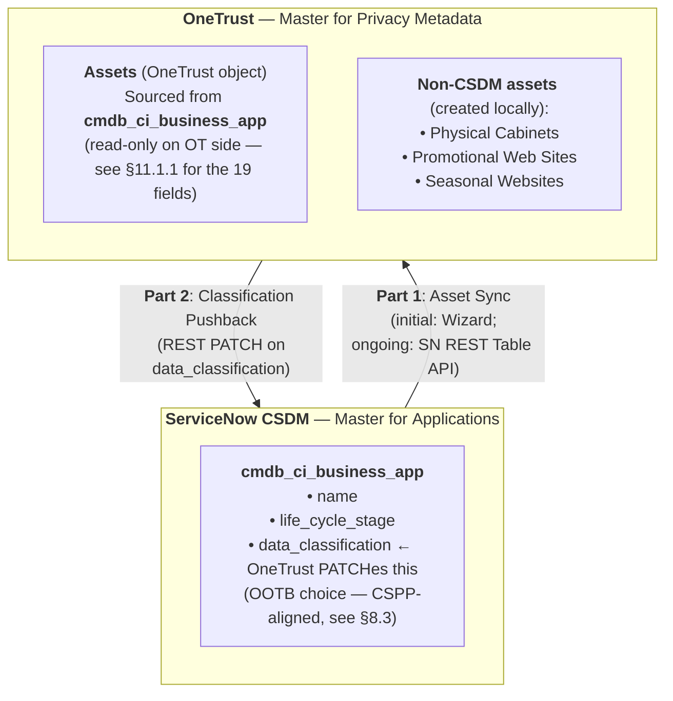
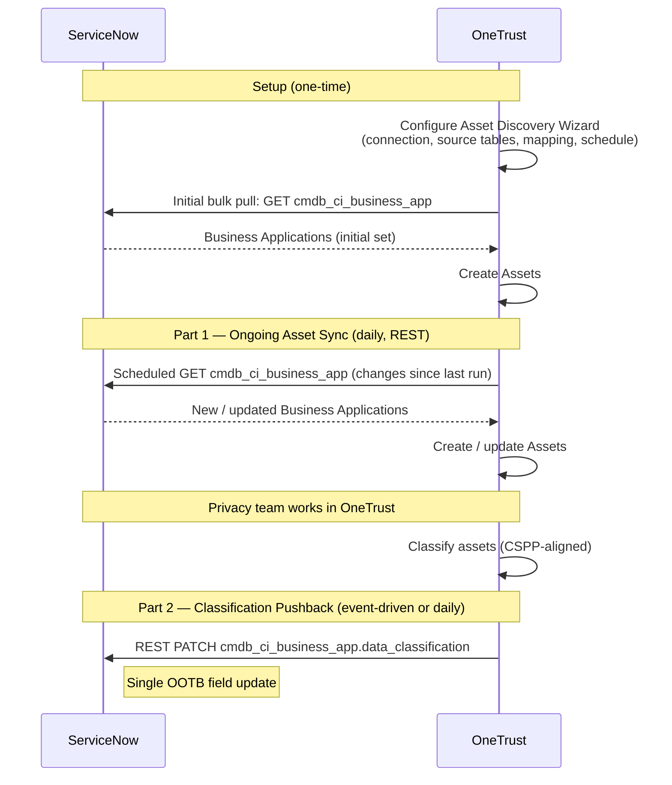

# OneTrust ↔ CSDM Integration — HLD (Direct Classification)

---

## 1. Document Control

**Date**: 2026-05-19<br>
**Status**: Draft — for team review<br>
**Author**: Victor Andreev<br>
**Design principle**: OOTB-first, zero custom schema. Data classification is carried on the OOTB `data_classification` choice field of `cmdb_ci_business_app` directly — a single value per application.

## 2. Sign-offs

| Name | Role |
|---|---|
| | Privacy Lead |
| | CSDM Architect |
| | DTPS Product Manager |
| | Information Security |
| | Service Owner — ServiceNow |
| | Service Owner — OneTrust |

## 3. Introduction

This blueprint defines an integration between **ServiceNow CMDB / CSDM** and **OneTrust** (Privacy Product) to satisfy **GDPR Article 30** requirements (Records of Processing Activities).

OneTrust and CSDM operate today as independent inventories with no automated sync — the resulting problems are detailed in §5 Current State.

The design establishes **CSDM as the master for application records** and **OneTrust as the master for privacy metadata**. Classification flows from OneTrust back to ServiceNow as a single OOTB field write on `cmdb_ci_business_app`.

## 4. Scope

### 4.1 In scope

- CSDM as the master system for application records consumed by OneTrust
- One-time initial bulk pull from CSDM to OneTrust using the OneTrust **Asset Discovery Wizard**; ongoing sync via scheduled SN REST Table API calls
- Map CSDM application fields to OneTrust Asset attributes (see §11.1)
- Classification flow back from OneTrust to ServiceNow as a single `data_classification` field write per application
- Classification values aligned to **CSPP Confidentiality Levels**, working with the OOTB choice list as it stands at CCH

### 4.2 Out of scope

- CSDM core schema changes (the integration writes to an OOTB field; no dictionary work)
- Per-data-type classification granularity (deliberately not modelled — see §4.3)
- Enterprise Architecture tool integration
- Vendor management integration
- Privacy Impact Assessment workflow design within OneTrust

### 4.3 Scope Boundaries

- **OOTB-first schema** — no custom dictionary entries on the CSDM side.
- **CSDM is the application master** — OneTrust does not create or modify application identity fields.
- **One classification value per application** — multi-classification (per-data-type) is deliberately not modelled. Per-data-type detail stays in OneTrust.
- **Asset sync is unidirectional** — CSDM → OneTrust only. Asset attributes synced from CSDM are read-only in OneTrust.
- **Classification pushback is a single field write** on `cmdb_ci_business_app.data_classification`.
- **Platforms remain as-is** — OneTrust, ServiceNow, and CSDM are the components in scope. The withdrawn OneTrust ServiceNow Store app is not reinstated.

## 5. Current State

### 5.1 Two independent inventories

| Dimension | OneTrust (Privacy Product) | ServiceNow CSDM |
|---|---|---|
| Purpose | GDPR Art 30 compliance (Records of Processing Activities) | IT service management, incident routing, portfolio governance |
| Application source | Created manually by BU and CSC business owners | Via Service Request with approval workflows |
| Review cycle | 1–2× per year (criticality-based) by business process owners | Continuous — Business Rules, MyID sync, manual updates |
| Taxonomy | Privacy-specific (Data Elements, Data Subjects, Legal Entities, DPIAs) | CSDM fields (lifecycle stage, architecture type, platform) |
| Asset coverage | Applications + Physical Cabinets + Promotional Web Sites + Seasonal Websites | Business Applications only |
| Data classification | Maintained via Data Elements + Data Classification on Assets | Not populated — `cmdb_ci_business_app.data_classification` is sparse at CCH today |
| Governance | Privacy team + DTPS product managers | CSDM team + Product Model owners |
| Platform | OneTrust SaaS (licensed) | ServiceNow SaaS |
| Connector status | OneTrust ServiceNow Store app withdrawn — integration relies on OOTB Asset Discovery Wizard (initial config) and SN REST Table API (ongoing) | N/A |

### 5.2 Current problems

1. **Field-level discrepancies**: lifecycle status diverges between systems (e.g., app marked decommissioned in OneTrust but active in CSDM). Directly impacts GDPR Art 30 inventory accuracy.
2. **Asset coverage boundary**: Physical Cabinets, Promotional Web Sites, and Seasonal Websites are out of scope of the Configuration Management Process — they are not Configuration Items in the CSDM sense (no IT-managed lifecycle, no service-delivery dependency, no infrastructure footprint), so the CMDB is not their system of record. Directly impacts GDPR Art 30 inventory completeness if OneTrust is not consulted as the authoritative source for these asset types.
3. **Shadow IT risk**: applications created in OneTrust by BU and CSC owners can be Shadow IT — missing DTPS governance.
4. **Process mismatch**: OneTrust Business Processes do not map cleanly to Signavio Process levels.
5. **No unique identifier**: no common key links the same application across both systems; reconciliation is manual.
6. **No data classification readable from CSDM**: `cmdb_ci_business_app.data_classification` is unpopulated for most records at CCH today. ServiceNow cannot answer "which Business Applications carry sensitive data?".
7. **Store connector withdrawn**: OneTrust's "OneTrust for ServiceNow" Store app no longer exists; the classification-pushback capability that was packaged in it is gone.

## 6. Future State

- Applications are **not created** in OneTrust by end users. They are pulled from CSDM — initial bulk pull via the OneTrust **Asset Discovery Wizard**; ongoing delta sync via scheduled SN REST Table API calls.
- Data classification is **maintained in OneTrust** (the privacy team's working environment) and **written back to ServiceNow** as a single `data_classification` field value on `cmdb_ci_business_app`.
- Classification values aligned to **CSPP Confidentiality Levels**.
- ServiceNow can answer "which Business Applications carry sensitive data?" via a one-step CMDB query on `data_classification`.
- Asset types not in CSDM (Physical Cabinets, Promotional Web Sites, Seasonal Websites) remain creatable in OneTrust only; all other application creation is blocked there.
- Decommissioning of an application in CSDM triggers a privacy-review task in OneTrust; the OneTrust asset is marked inactive (not deleted) pending review.

## 7. Solution Design

### 7.1 Two Masters

| Domain | Master | Why |
|---|---|---|
| Applications — existence, ownership, lifecycle | **ServiceNow CSDM** | System of record for IT applications, services and their lifecycles |
| Data classification | **OneTrust** | System of record for privacy metadata and Article 30 data |

### 7.2 Architecture



### 7.3 Integration Parts Summary

| Part | Direction | Mechanism | ServiceNow-side work |
|---|---|---|---|
| **1. Asset Sync** | OneTrust pulls from SN | **Initial bulk pull** via the OneTrust Asset Discovery Wizard. **Ongoing sync** via OneTrust-scheduled REST Table API calls to `cmdb_ci_business_app` and `cmdb_application_product_model` | Service account with read access to `cmdb_ci_business_app` and `cmdb_application_product_model` |
| **2. Classification Pushback** | OneTrust → SN | OneTrust calls the SN REST Table API directly — single `PATCH` on `cmdb_ci_business_app` | Service account with write access to `cmdb_ci_business_app.data_classification` only |

**On terminology**: the **integration mechanism** is the SN REST Table API on the ServiceNow side and the OneTrust REST API on the OneTrust side. The **Asset Discovery Wizard is a OneTrust-side configuration tool** used during initial setup to define the connection, source tables, field mapping, and schedule — once configured, the Wizard is not in the runtime path; OneTrust's scheduler drives all subsequent calls over REST.

### 7.4 Sync Flow



### 7.5 Why the direct field

ServiceNow's OOTB schema includes a `data_classification` choice field directly on `cmdb_ci_business_app` (dictionary entry `data_classification` on table `cmdb_ci_business_app`, system-created). Writing to this field gives a one-step CMDB query for "which applications carry sensitive data?" and keeps the SN-side write footprint to a single record per classification event.

**Why this pattern fits a leaner build**:

- **Single write per classification event** — one REST `PATCH`. Failure modes collapse to one outcome to reconcile.
- **Native OOTB consumer** — any CMDB report, dashboard, or business rule that already filters `cmdb_ci_business_app` reads the field with no extra joins.
- **Schema stability** — the field exists OOTB on a foundational CSDM table; SN upgrades do not threaten it.
- **Lower OneTrust workflow complexity** — the OneTrust side issues one PATCH, not a coalesce-then-relate sequence.

**The trade-off** is granularity: the field carries one overall value per application, not per data type. The application's overall posture is captured in CMDB; "which apps process *email addresses* specifically?" is answered from OneTrust, where Data Elements are native. The privacy team's reporting workflow needs to accept that per-data-type queries run from OneTrust, not from CMDB.

## 8. Requirements

### 8.1 Functional Requirements

| ID | Requirement |
|---|---|
| FR-1 | All in-scope CSDM Business Applications appear in OneTrust within 24 hours of creation or update in CSDM |
| FR-2 | OneTrust blocks manual creation of application records by end users; Physical Cabinets, Promotional Web Sites, and Seasonal Websites remain creatable in OneTrust |
| FR-3 | Privacy classification set in OneTrust appears on the corresponding `cmdb_ci_business_app.data_classification` field within 24 hours |
| FR-4 | Decommissioning of a CSDM application (`life_cycle_stage` ∈ {`Retire`, `Decommission`}) triggers a privacy-review task in OneTrust; the OneTrust asset is marked inactive (not deleted) |
| FR-5 | CSDM is the only point at which `cmdb_ci_business_app` identity fields are created or modified. OneTrust writes are restricted to `cmdb_ci_business_app.data_classification` |
| FR-6 | A CMDB query on `data_classification IN (confidential, restricted, highly_sensitive)` returns the canonical list of Business Applications carrying sensitive data |

### 8.2 Non-Functional Requirements

| ID | Requirement |
|---|---|
| NFR-1 | **Latency — Part 1 (asset sync)**: up to 24 hours; daily scheduled delta pull acceptable. Real-time webhook is a deferred enhancement |
| NFR-2 | **Latency — Part 2 (classification pushback)**: up to 24 hours; daily scheduled cadence acceptable. Event-driven on assessment completion is the upgrade path |
| NFR-3 | **Volume**: ~840 Business Applications at CCH; classification events at 1–2× per app per year. Steady-state PATCH volume is low; performance is not a design concern |
| NFR-4 | **Idempotency — Part 1**: re-pull of the same record produces no duplicates; OneTrust matches by `sys_id` |
| NFR-5 | **Audit**: all SN-side writes traceable in `sys_audit` per OOTB behaviour; all OT-side writes traceable in OneTrust's native audit |
| NFR-6 | **Error handling**: 429/5xx retried with exponential backoff; 4xx routed to a manual remediation queue; all errors correlated by `cmdb_ci_business_app.sys_id` (implementation in §9.4) |

### 8.3 CSPP Alignment

The OOTB `data_classification` field on `cmdb_ci_business_app` is a system-created choice list. At CCH today the active choice values cover 4 of the 5 CSPP levels: `public`, `internal`, `confidential`, `highly_sensitive`. The 5th value — `restricted` — must be added to the `sys_choice` set as a pre-go-live config step (see Decision #3 in §8.5 for the verify-and-add).

| CSPP Confidentiality Level | OOTB choice value | Notes |
|---|---|---|
| Public | `public` | OOTB, present at CCH |
| Internal | `internal` | OOTB, present at CCH |
| Confidential | `confidential` | OOTB, present at CCH |
| Restricted | `restricted` | **Not present at CCH today** — `sys_choice` addition required pre-go-live |
| Highly Restricted | `highly_sensitive` | OOTB, present at CCH |

### 8.4 GDPR Article 30 Mapping

| Art 30 Requirement | Source |
|---|---|
| Name and contact details of the controller | OneTrust (Legal Entities) |
| Purposes of the processing | OneTrust (Processing Activities) |
| Categories of data subjects | OneTrust (Data Subject Types) |
| Categories of personal data | OneTrust (Data Elements). CSDM carries only an overall classification flag per app — per-data-type queries run from OneTrust, not CMDB |
| Categories of recipients | OneTrust (Vendors) |
| Transfers to third countries | OneTrust (Transfer records) |
| Time limits for erasure | OneTrust (Data retention periods) |
| Description of security measures | Gap — neither system captures this systematically; separate workstream |
| Applications processing personal data | CSDM → OneTrust (Part 1) + `data_classification IN (confidential, restricted, highly_sensitive)` on CSDM (Part 2) |
| Physical assets (Cabinets) | OneTrust only (local creation) — not in CSDM scope |
| Web assets (Promotional Web Sites, Seasonal Websites) | OneTrust only (local creation) — not in CSDM scope |

### 8.5 Open Design Decisions

| # | Question | Status |
|--:|---|---|
| 1 | Is the Asset Discovery Wizard available in the OneTrust tenant? | OPEN — first-priority validation |
| 2 | Sync alternative — filtered vs full pull from CSDM? | PROPOSED — full pull; filtering happens inside OneTrust to avoid a circular dependency on classification existing in CSDM before the pull |
| 3 | `data_classification` choice values — current state at CCH (§8.3) | OPEN — verify `sys_choice` for `cmdb_ci_business_app.data_classification`; add `restricted` if absent |
| 4 | Decommission handling — when CSDM marks an app as `Retire` or `Decommission`, what happens in OneTrust? | PROPOSED — mark the corresponding asset as inactive (do not delete); trigger a privacy-review task before archive. See §9.3 |
| 5 | Pushback cadence — event-driven on assessment completion, or daily scheduled? | PROPOSED — daily scheduled to start; revisit if latency proves problematic |
| 6 | Phase-1 scope filter — centrally managed apps only, or all? | OPEN — derive from `company`, `support_group`, or `business_unit` |
| 7 | Existing OneTrust records with no CSDM match — migration approach? | OPEN — categorise and onboard to CSDM, or accept as OneTrust-only |
| 8 | Physical Cabinets / Promotional Websites — extend CSDM, or keep OneTrust-only? | OPEN — CSDM scope decision |

## 9. Implementation

### 9.1 Part 1 — Asset Sync

1. Confirm Asset Discovery Wizard availability in the OneTrust tenant (Decision #1)
2. Create a ServiceNow service account with **read access** to `cmdb_ci_business_app` and `cmdb_application_product_model`
3. Add the credentials to OneTrust
4. Configure the Asset Discovery Wizard (one-time): source tables `cmdb_ci_business_app` and `cmdb_application_product_model`, field mapping per §11.1.1, schedule for ongoing pulls
5. Run the initial bulk pull via the Wizard; reconcile existing OneTrust records to CSDM apps by `sys_id`
6. From this point on, the OneTrust scheduler drives the daily delta pull over the SN REST Table API — no further Wizard interaction is required
7. Block manual application creation in OneTrust for end users; allow non-CSDM asset types (Physical Cabinets, Promotional Web Sites, Seasonal Websites) only

### 9.2 Part 2 — Classification Pushback

1. Verify the `data_classification` choice list on `cmdb_ci_business_app` carries the values agreed in §8.3 (resolve Decision #3 first)
2. Create a ServiceNow service account with **write access scoped to `cmdb_ci_business_app.data_classification` only**
3. Add the credentials to OneTrust
4. Configure the OneTrust workflow: on classification change, issue a single `PATCH` against the SN REST Table API per §11.1.2
5. End-to-end test: classify a test app in OneTrust → verify the field updates in SN → verify no duplicate or orphaned rows → reclassify and verify update-in-place

### 9.3 Decommissioning Rule

When `cmdb_ci_business_app.life_cycle_stage` transitions to `Retire` or `Decommission`:

- OneTrust marks the corresponding asset as **inactive** (does not delete)
- A **privacy-review task** is opened in OneTrust before any archive action
- The `data_classification` value on the SN side is left unchanged — a decommissioned app may still hold sensitive data pending erasure

### 9.4 Error Handling

| Class | Response | Notes |
|---|---|---|
| `429 Too Many Requests` | Retry with exponential backoff; cap at N attempts | Volume is low; rate-limiting unlikely but pattern is standard |
| `5xx` | Retry with exponential backoff; cap at N attempts; alert if cap reached | OneTrust workflow surfaces failures to a remediation queue |
| `4xx` (other than 429) | No retry — log and route to a manual remediation queue | Indicates payload or auth issue; needs a human |
| All errors | Log with correlation key = `cmdb_ci_business_app.sys_id` | Lets remediation match SN-side audit trail |

**Volume note**: ~840 Business Applications at CCH; classification events are tied to assessment cadence (1–2× per year per app). Steady-state PATCH volume is low; performance is not a design concern.

## 10. Planning and Risk Management

### 10.1 Planning

**Pre-go-live gates** (all must close before sync activation):

1. Asset Discovery Wizard available in the OneTrust tenant (Decision #1)
2. `restricted` choice value added to `sys_choice` on `cmdb_ci_business_app.data_classification` (Decision #3)
3. ServiceNow service accounts provisioned with the scopes per §11.2 (read for Part 1; narrow write for Part 2)

**Phasing**:

- **Phase 1**: centrally-managed applications only. Filter source attribute resolved per Decision #6 (`company`, `business_unit`, or `support_group`)
- **Phase 2** (deferred): include locally-managed (BU) applications when BU rollout is ready

**Dependencies**:

- OneTrust tenant configured to block manual creation of application records (allows non-CSDM asset types: Physical Cabinets, Promotional Web Sites, Seasonal Websites)
- Existing OneTrust records reconciled to CSDM apps by `sys_id` (Decision #7)

### 10.2 Risk Register

| Risk | Impact | Mitigation |
|---|---|---|
| Asset Discovery Wizard not available in OneTrust tenant | Cannot perform initial bulk pull via OOTB | Drive the initial load with the same SN REST Table API calls the scheduler would use; covered in Decision #1 |
| `data_classification` overwritten locally on the SN side by an admin / Business Rule | OneTrust-pushed value lost | Service account scope (write only on `data_classification` for OT) plus a Business Rule guard that rejects writes from sources other than the OT service account |
| `restricted` choice value not added before go-live | Part 2 PATCH calls carrying `restricted` are rejected by SN; classification pushback fails for that subset of apps | Pre-go-live config gate — Decision #3 must close before sync activation |
| Decommissioned app still holds sensitive data | GDPR non-compliance if archived prematurely | Decision #4 — privacy review task is mandatory; track SLA |
| Existing OneTrust records with no CSDM match | Shadow IT after migration | Decision #7 — categorise and onboard, or accept as OneTrust-only with a marker |

## 11. Appendix

### 11.1 Data mapping

#### 11.1.1 CSDM → OneTrust — fields synced (Part 1)

Nineteen OOTB attributes, read-only on the OneTrust side.

| # | OneTrust Attribute | CSDM Source Field | Source Table |
|---:|---|---|---|
| 1 | Name | `name` | `cmdb_ci_business_app` |
| 2 | Administration | derived from `company` / `business_unit` / `support_group` (see Decision #6) | `cmdb_ci_business_app` |
| 3 | Business Criticality | `business_criticality` | `cmdb_ci_business_app` |
| 4 | Product | `product` (via `model_id`) | `cmdb_application_product_model` |
| 5 | Platform | `platform` | `cmdb_ci_business_app` |
| 6 | Platform Architect | OOTB user-reference (candidates: `managed_by`, `assigned_to`) | `cmdb_application_product_model` |
| 7 | Product Manager | OOTB user-reference (candidate: `owned_by`) | `cmdb_application_product_model` |
| 8 | Application Type | `application_type` | `cmdb_ci_business_app` |
| 9 | Install Type | `install_type` | `cmdb_ci_business_app` |
| 10 | Platform Host | `platform_host` | `cmdb_ci_business_app` |
| 11 | Life Cycle Stage | `life_cycle_stage` | `cmdb_ci_business_app` |
| 12 | Life Cycle Stage Status | `life_cycle_stage_status` | `cmdb_ci_business_app` |
| 13 | Business Owner | `business_owner` | `cmdb_ci_business_app` |
| 14 | Description | `short_description` | `cmdb_ci_business_app` |
| 15 | IT Application Owner | `it_application_owner` | `cmdb_ci_business_app` |
| 16 | Install Status | `install_status` | `cmdb_ci_business_app` |
| 17 | Operational Status | `operational_status` | `cmdb_ci_business_app` |
| 18 | Updated | `sys_updated_on` | `cmdb_ci_business_app` |
| 19 | Vendor | `vendor` (core_company ref) | `cmdb_ci_business_app` |

**Round-trip identifier** (carried in addition to the 19 attributes): `cmdb_ci_business_app.sys_id`. OneTrust stores it as the external ID on the corresponding Asset and uses it for every Part 2 PATCH.

#### 11.1.2 OneTrust → CSDM — single-field PATCH (Part 2)

One REST `PATCH` per classification event, addressing one application by `sys_id`:

```http
PATCH /api/now/table/cmdb_ci_business_app/{sys_id}
Content-Type: application/json

{
  "data_classification": "confidential"
}
```

| Field | Authored by | Notes |
|---|---|---|
| `cmdb_ci_business_app.data_classification` | OneTrust | OOTB choice — see §8.3 for the CSPP mapping |

**Identifier**: `cmdb_ci_business_app.sys_id` is the system-of-record identifier. OneTrust stores it as the external ID on the corresponding Asset and uses it for every Part 2 PATCH.

**Governance**: ServiceNow remains the only point at which application records are created or have their identity fields modified. OneTrust writes to `data_classification` and nothing else on `cmdb_ci_business_app`. The service account scope must enforce this — read on all fields, write only on `data_classification`.

### 11.2 Security components

#### ServiceNow service accounts

| Purpose | Scope | Authentication |
|---|---|---|
| Part 1 — Asset Sync (read) | Read on `cmdb_ci_business_app` and `cmdb_application_product_model` | OAuth 2.0 (preferred) or Basic Auth |
| Part 2 — Classification Pushback (write) | Write on `cmdb_ci_business_app.data_classification` only — read on the same record permitted for the round-trip lookup | OAuth 2.0 (preferred) or Basic Auth |

Two distinct accounts are recommended (one per Part) so that scope violations are immediately attributable. A single multi-scope account is permitted if customer policy requires it, but in that case the Business Rule guard (below) becomes mandatory rather than recommended.

#### Authorization guard

A Business Rule on `cmdb_ci_business_app` that rejects writes to `data_classification` from any source other than the Part 2 service account. Prevents OneTrust-pushed values from being silently overwritten by local admins or other Business Rules.

#### Roles and groups

- **ServiceNow**: no new roles required — the integration uses OOTB CMDB read / write permissions via the service accounts above
- **OneTrust**: integration admin role for credential management, privacy team roles for assessment work (per OneTrust's native model)

### 11.3 Plugins

No new ServiceNow plugins are required. The integration uses:

- OOTB **REST Table API** on the ServiceNow side
- OOTB **Business Rule** on `cmdb_ci_business_app` (the authorization guard)
- OOTB **`data_classification` choice field** on `cmdb_ci_business_app`
- OOTB **`sys_audit`** for the audit trail

On the OneTrust side, the **Asset Discovery Wizard** is a native OneTrust capability and requires no third-party connector. The withdrawn "OneTrust for ServiceNow" Store app is **not** reinstated.

### 11.4 References

- ServiceNow Docs — `cmdb_ci_business_app` table and `data_classification` field
- ServiceNow Community — [Data Classification Fields in CMDB](https://www.servicenow.com/community/cmdb-forum/data-classification-fields-in-cmdb/m-p/2715799)
- [OneTrust Data Mapping Automation](https://www.onetrust.com/products/data-mapping-automation/)
- [OneTrust Developer Portal](https://developer.onetrust.com/)
- GDPR Article 30 — Records of Processing Activities
- CSPP Data Classification Policy (internal)
