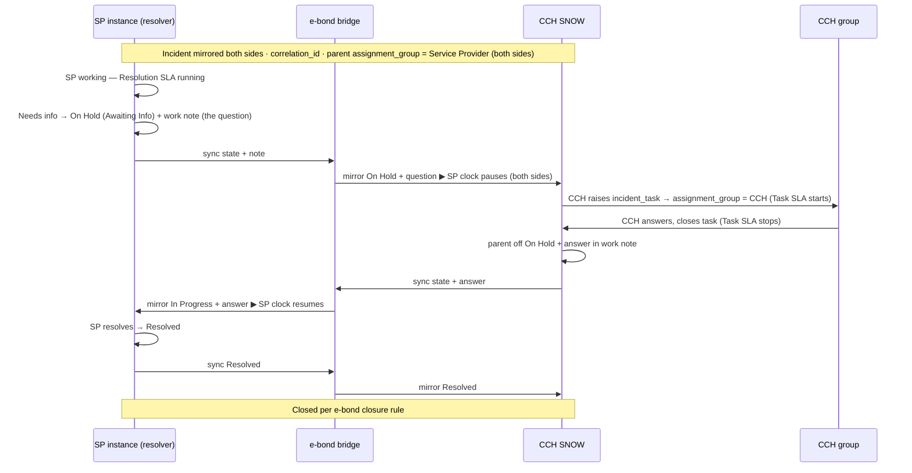

# Service Provider ↔ CCH E-Bond — Incident Workflow (clocking + `incident_task`)

**Version**: 0.1` `
**Status**: Draft — for review` `
**Scope**: a generic pattern for any e-bonded **Service Provider (SP)** that resolves incidents on CCH's behalf (e.g. NTT, Orange). "**Service Provider (resolver)**" = the SP that does the work; **CCH** = the customer.

**Purpose**: a simple, best-practice walkthrough of how the **Service Provider (resolver)** requests information from CCH across the e-bond, with SLA clocking handled correctly and the obligation carried by an `incident_task`. Shows the **two-instance mirroring** and what actually moves across the bond.

---

## Records & clocks

- **Incident** — e-bonded, mirrored on both instances and tied by `correlation_id`. Parent `assignment_group = Service Provider` (the mapped CCH-side group representing the responsible SP team) on **both** sides. Carries the **Resolution SLA** (the contract clock).
- **Incident Task** (`incident_task`) — raised on demand on the **CCH side**, `assignment_group = a single designated CCH group`. Carries its **own Task SLA** (escalatable within CCH).

---

## One CCH group, one touchpoint (keep it simple)

The CCH side of an e-bonded incident is **one** coordination role: follow the mirrored incident and answer the SP's info requests. Use **a single designated CCH group for both** — don't split "the group that follows" from "the group that answers". If a specific request needs a specialist, that group reassigns **that one task** on demand. Add a second standing group only on **evidence** (a real bottleneck, or a genuinely separate operational team) — not preemptively.

---

## What flips vs. what stays local

| Crosses the bond (flips back & forth)                      | Stays local to each instance                                         |
| ---------------------------------------------------------- | -------------------------------------------------------------------- |
| **State** (On Hold ↔ In Progress)                   | **Parent `assignment_group`** (SP both sides — never flips) |
| **Work notes / comments** (the question, the answer) | **The `incident_task`** (created on CCH side, owned by CCH)  |
| Attachments                                                | **SLAs** (each instance runs its own clock)                    |

So "flipping back and forth" = **state + comments syncing**, *not* the assignment group moving and *not* the task crossing over

---

## Mirrored flow (SP resolving, needs info from CCH)

---

## Step-by-step

| # | Event                                                                                                   | Incident state     | Resolution SLA (SP) | Task SLA (CCH)    |
| - | ------------------------------------------------------------------------------------------------------- | ------------------ | ------------------- | ----------------- |
| 1 | Incident raised & e-bonded;`correlation_id` minted; `assignment_group = SP`                         | New → In Progress | **running**   | —                |
| 2 | SP investigates, needs input from CCH                                                                   | In Progress        | running             | —                |
| 3 | SP sets parent**On Hold — Awaiting Info** + work note (the question); state + note mirror to CCH | **On Hold**  | **paused**    | —                |
| 4 | CCH raises `incident_task` → `assignment_group = CCH`                                              | On Hold            | paused              | **running** |
| 5 | CCH works the task (escalates*within CCH* if slow), provides info, **closes task**              | On Hold            | paused              | **stopped** |
| 6 | Task closure flips parent**off hold**; answer mirrors back to SP                                  | In Progress        | **resumes**   | —                |
| 7 | SP resolves                                                                                             | Resolved           | **stopped**   | —                |
| 8 | Closure per e-bond closure rule                                                                         | Closed             | finalised           | —                |

---

## Touchpoints with CCH's internal incident process

The e-bond is a **boundary integration** — CCH's internal incident process is **unchanged**. The only coupling is **translation at the seam**; lifecycle-state mapping is the primary one.

| Seam touchpoint                                           | Nature                                  |
| --------------------------------------------------------- | --------------------------------------- |
| **Lifecycle / state** (SP ↔ CCH states)            | the main one — canonical-lifecycle map |
| **Priority / Impact-Urgency** (e.g. CCH P0 = SP P1) | value mapping                           |
| **Close / resolution codes**                        | value mapping                           |
| **Assignment-group mapping**                        | SP teams ↔ CCH queues                  |
| **Closure authority**                               | which side may close, and when          |
| **CCH-facing SLA on e-bonded records**              | clock + On-Hold pause rules             |
| **Major-incident bridge**                           | the one place it touches CCH MIM        |

All translation — none of it reshapes CCH's incident process.

---

## Rules that make it correct (best practice)

1. **SLA pause is state-driven** — On Hold — Awaiting Info pauses the Resolution SLA. Not assignment-driven.
2. **Parent `assignment_group` never moves** — stays SP throughout, on both sides. CCH ownership lives only on the task.
3. **One task per discrete request** — clear question, its own SLA, its own audit. Don't reuse a task for a second ask.
4. **Task ↔ hold are linked** — parent goes On Hold when the task opens, comes off hold when it closes; the parent cannot resolve while an info task is open.
5. **Map onto a canonical lifecycle** — reason-code aware for On Hold; no free-text state.

---

## Alternative — info request handled on the CCH-side incident (instead of a task)

Rather than a child `incident_task`, the info request can be carried **at the incident level on the CCH side**: the e-bonded mirror is used directly — CCH takes the ball on the parent (the CCH-side incident's `assignment_group` moves to a CCH group while the SP awaits info, **On Hold** pausing the SP clock; it returns to the SP once the info is supplied).

It is a legitimate choice — fewer records, and some SP toolchains don't support cross-org tasks well — but it carries real drawbacks, which is why the task model is preferred:

- **Ownership ambiguity** — reassigning the incident makes it look like the SP no longer owns resolution, when it still does (it is only waiting). It conflates "awaiting input" with "handed off".
- **Two group namespaces** — the CCH liaison group has no clean SP-instance counterpart (the §11.1.4 mapping is SP-team ↔ CCH-queue), so the reassignment doesn't map cleanly across the bond.
- **More loop surface** — flipping `assignment_group` means extra cross-bond writes, i.e. more echo/loop risk.
- **No discrete obligation** — the info ask isn't its own record, so it has no separate SLA, audit, or escalation; CCH responsiveness can't be measured independently.
- **No parallelism** — if the SP needs input from two different CCH groups at once, one incident-level assignment can't represent both; multiple tasks can.

If a given SP requires this model, it's a **bilateral** decision and must still: keep SLA pausing **state-driven** (On Hold), define a **return rule** (CCH hands back to the SP with the info), and ensure the CCH group **maps on both instances**.

---

## ⚠️ Danger Zone — do **not**

- **No BSOs.** Don't assign the task to — or route on — a **Business Service Owner**. BSO is *business accountability*, not an operational queue; using it conflates ownership with coordination. Use a directly designated CCH **operational group** (a queue), not an owner role, and never an individual. It also **widens loop surface** — see *Human-initiated loop* below.
- **No CCH CSDM dependency.** The flow must not read or derive from CSDM (service hierarchy, Service Offerings, service-derived support groups). The CCH group is set **directly** on `incident_task.assignment_group`. CSDM (CI/service mapping, business impact) is **orthogonal** — handled in Configuration Management documentation — and nothing here waits on CSDM maturity.
  - **Why this matters most:** coupling the e-bond to CSDM means **any change to CCH's CSDM model forces a rework of every e-bond, with every SP**. CCH's CSDM is itself still evolving — so a CSDM dependency would turn each model change into a multi-SP integration project. Decoupling keeps the e-bonds stable while CSDM matures independently; the blast radius of a CSDM change stays inside CSDM.
- **Looping risks.** Bidirectional sync with no loop guard = infinite echo (ping-pong). Loop prevention is **mandatory**, but **don't make it depend on the SP agreeing to a tagging scheme**:
  - **Source-tagging** (each write carries the originating instance; receiver suppresses the echo) is the cleanest — but it's bilateral. For productized bridges it's usually **built in** (NTT iHub, ServiceNow Service Bridge); confirm the bridge already does it.
  - If the SP won't/can't guarantee it, CCH breaks the loop **unilaterally on its own side**: (a) **integration-user echo suppression** — a business rule that does *not* re-emit any change applied by CCH's inbound e-bond account; (b) **idempotent / delta-only propagation** — never emit a no-op write, so any residual bounce dies on arrival. A loop needs both legs to re-emit, so CCH suppressing its own echo is sufficient.
  - Watch **automation loops** too: a state change → task → state change can loop if not guarded.
- **Human-initiated loop (tagging can't catch this).** Source-tagging stops *machine echo* on a mirrored record — it does **not** stop a **person** opening a *new* incident toward the SP (e.g. reacting to an escalated info-task), which duplicates the original and bounces across the bond. Two defences:
  - **(i) Minimise the CCH groups involved.** Every group/role that can touch an e-bonded incident is another potential origin of a duplicate SP-bound ticket — so **"one CCH group" is loop *containment*, not just simplicity**. The more groups, the more chances someone fires a parallel incident. **Involving BSOs makes it worse**: business owners aren't operational or e-bond-disciplined, so an escalation reaching them is the *most* likely to spawn a parallel ticket — a second reason (beyond accountability-vs-execution) to keep them out.
  - **(ii) Creation-side guardrails.** Answer-and-close the task — escalation drives *getting it answered*, never "raise a new incident"; **gate the outbound e-bond** so only the designated CCH coordination group can push to the SP; run a **correlation/duplicate check at intake** ("link to the existing incident, don't create"); enforce mandatory parent / `correlation_id` linkage that the bond can flag or block.
- **No assignment-driven SLA.** Pause on **state** (On Hold), never on "who holds the group".
- **No `watch_list` for groups.** It's a `sys_user` list — users only, not groups.
- **No custom `u_` group field** for a "CCH responsible group" — directly designated group on the task; don't add schema.
- **No many-to-one state maps** without a reverse rule — they break the round-trip (the trap in the Orange proposal: two "On Hold" reasons → one CCH state).
- **Don't reshape CCH's internal incident process** to match the SP — translate at the seam.
- **Don't pre-split the CCH role** into two standing groups — one group, delegate per-task only on evidence.
